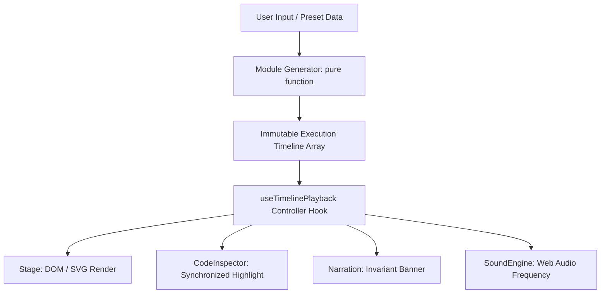

# 🏗️ StepDSA System Architecture

  
  
  
  

StepDSA is an interactive algorithm workbench designed around zero-latency scrubbing, deterministic reproducibility, and pedagogical rigor.

---

## 📐 Core Engineering Principles

1. **Deterministic Snapshots over Stateful Mutators:**
   Traditional visualizers use async `sleep()` loops modifying shared mutable state. StepDSA computes an array of immutable `ExecutionFrame<TState>[]` upfront in pure memory. Scrubbing backwards or jumping to any arbitrary step is instantaneous $\mathcal{O}(1)$ array indexing.

2. **Decoupled Stage Renderers:**
   Visual stages receive `frame.state` as a pure React rendering target. Whether rendered as 2D vertical bars, tree node graphs, or SVG pointers, stage renderers hold zero internal playback state.

3. **Multi-Track Synchronization:**
   Every frame indexes:
   * **Visual Elements:** Values, statuses (`comparing`, `swapping`, `sorted`, `pivot`).
   * **Code Line Tracker:** Synchronized active line across 5 languages.
   * **Pedagogical Narration:** Plain-English and mathematical explanation of the invariant preserved during this step.
   * **Sound Engine:** Frequency tone synthesized from element values.

---

## 🔄 Execution Pipeline

---

## 🧩 Directory Organization

* **`src/core/`**: Timeline controller, types, and playback logic.
* **`src/modules/`**: Pure algorithm implementations, theory, and stage renderers.
* **`src/components/`**: Modular UI components (stage, player, code inspector, playground, drawer).
* **`src/utils/`**: Web Audio synthesizer, array generators, and formatters.
* **`cli/`**: Offline C++ and Python tracers for custom code execution.
* **`docs/`**: Curriculum, architecture, and developer specifications.
