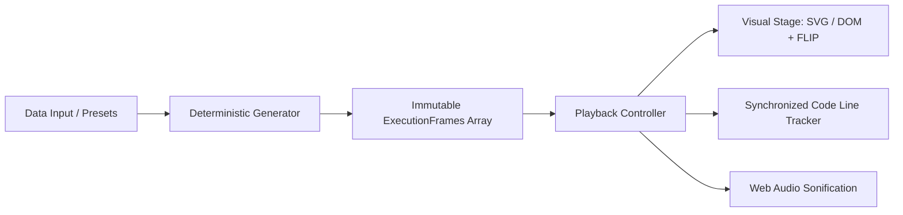

<div align="center">

# ⚡ StepDSA

### The Modern Interactive DSA Learning Platform & Time-Travel Visualizer

<p align="center">
  <a href="LICENSE"></a>
  <a href=".github/workflows/ci.yml"></a>
  <a href="CONTRIBUTING.md"></a>
  <a href="https://www.typescriptlang.org/"></a>
  <a href="https://react.dev/"></a>
  <a href="https://tailwindcss.com/"></a>
</p>

<p align="center">
  
  
  
  
  
</p>

**Interactive Textbook** &nbsp;•&nbsp; **Deterministic Step Visualizer** &nbsp;•&nbsp; **Multi-Language Inspector** &nbsp;•&nbsp; **DSA Playground**

[🌐 Live Web Demo](https://ThanhNguyxnOrg.github.io/StepDSA/) · [📖 Master Curriculum (54 Modules)](docs/MASTER_CURRICULUM.md) · [🏗️ Architecture Spec](ARCHITECTURE.md) · [💻 CLI Guide](docs/CLI.md) · [🐛 Report Bug](.github/ISSUE_TEMPLATE/bug_report.yml)

</div>

---

## 🌟 Why StepDSA?

Most existing algorithm visualizers suffer from the same fundamental flaws:
1. **Passive Watching:** Users sit through non-scrubbable, imperative animation loops without truly building intuition.
2. **Disconnected Theory:** Visualization is separated from the actual code invariants and mental models required in ICPC and technical interviews.
3. **Dated Aesthetics:** Cluttered interfaces with canvas-only graphics, lack of variable tracking, and confusing modal settings.

**StepDSA reimagines algorithm education as an interactive workbench:**
* ⏱️ **Deterministic Time-Travel Engine:** Instant scrubbable timeline with zero-lag reverse stepping (`←`), speed controls (`0.25x` to `2x`), and step narration.
* 💻 **Synchronized Multi-Language Code:** Live execution line tracking across **C++ (ICPC Standard), Python, TypeScript, Java, and Pseudocode**.
* 🧪 **Interactive Playground & Edge Cases:** Stress-test algorithms with custom arrays, reverse-sorted inputs, duplicates, and worst-case patterns.
* 📖 **Invariant-Driven Theory Panel:** Clear mental models, invariant breakdowns, and Big-O proofs alongside every step.
* 🎵 **Auditory Sonification:** Web Audio API synth tones mapped to element values—hear entropy decrease in real time as arrays sort.
* 🛠️ **Developer Studio & CLI:** Run your own C++ or Python code offline, export execution traces, and replay them visually in the browser.

---

## 🧩 Supported Algorithms & Curriculum

| Category | Algorithm / Structure | Time Complexity | Space Complexity | Status |
| 🔄 **Sorting** | **Quicksort (Lomuto Partition)** | $\mathcal{O}(n \log n)$ / $\mathcal{O}(n^2)$ | $\mathcal{O}(\log n)$ |  |
| 🔄 **Sorting** | **Mergesort (Divide & Conquer)** | $\mathcal{O}(n \log n)$ | $\mathcal{O}(n)$ |  |
| 🔄 **Sorting** | **Insertion Sort (Incremental Build)** | $\mathcal{O}(n)$ / $\mathcal{O}(n^2)$ | $\mathcal{O}(1)$ |  |
| 🔄 **Sorting** | **Selection Sort (Minimum Scan)** | $\mathcal{O}(n^2)$ | $\mathcal{O}(1)$ |  |
| 🔄 **Sorting** | **Bubble Sort (Adaptive Invariant)** | $\mathcal{O}(n)$ / $\mathcal{O}(n^2)$ | $\mathcal{O}(1)$ |  |
| 🔍 **Searching** | **Linear Search (Sequential Scan)** | $\mathcal{O}(n)$ | $\mathcal{O}(1)$ |  |
| 🔍 **Searching** | **Binary Search (Invariant Halving)** | $\mathcal{O}(\log n)$ | $\mathcal{O}(1)$ |  |
| 🎯 **Arrays** | **Sliding Window (Max Sum Subarray)** | $\mathcal{O}(n)$ | $\mathcal{O}(1)$ |  |
| 🎯 **Arrays** | **Two Pointers (Container With Most Water)**| $\mathcal{O}(n)$ | $\mathcal{O}(1)$ |  |
| 🔗 **Lists** | **Singly Linked List (Insert, Delete, Reverse)** | $\mathcal{O}(1)$ / $\mathcal{O}(n)$ | $\mathcal{O}(n)$ |  |
| 🌲 **Trees** | **Binary Search Tree (BST Construction & Traversal)** | $\mathcal{O}(\log n)$ / $\mathcal{O}(n)$ | $\mathcal{O}(n)$ |  |
| 🌲 **Trees** | **Trie (Prefix Tree & Autocomplete)** | $\mathcal{O}(L)$ | $\mathcal{O}(\Sigma \cdot L \cdot N)$ |  |
| 🌲 **Trees** | **Binary Heap (Priority Queue Push & Sift-Down)** | $\mathcal{O}(\log n)$ | $\mathcal{O}(n)$ |  |
| 🌐 **Graphs** | **BFS Wavefront (Level-Order Queue Traversal)** | $\mathcal{O}(V + E)$ | $\mathcal{O}(V)$ |  |
| 🌐 **Graphs** | **DFS Traversal (Call Stack & Cycle Detection)** | $\mathcal{O}(V + E)$ | $\mathcal{O}(V)$ |  |
| 🌐 **Graphs** | **Topological Sort (Kahn's In-Degree DAG)** | $\mathcal{O}(V + E)$ | $\mathcal{O}(V)$ |  |
| 🌐 **Graphs** | **Dijkstra's Algorithm (Min-Heap Shortest Path)** | $\mathcal{O}((V + E) \log V)$ | $\mathcal{O}(V + E)$ |  |
| 📊 **DP** | **0/1 Knapsack Problem (2D Table & Backtrack)** | $\mathcal{O}(n \cdot W)$ | $\mathcal{O}(n \cdot W)$ |  |
| 📐 **Spatial 3D** | **Octree (3D Spatial Decomposition)** | $\mathcal{O}(\log n)$ | $\mathcal{O}(n)$ |  |

*For complete pedagogical notes and curriculum roadmap, see [Master Curriculum & Guide](docs/MASTER_CURRICULUM.md).*

---

## 🏗️ Architecture & Core Engine

StepDSA is built upon the **Deterministic Snapshot Timeline Pattern**:



### Module Interface Contract

```typescript
export interface AlgorithmModule<TInput = any, TState = any> {
  id: string;
  title: string;
  category: 'sorting' | 'searching' | 'arrays' | 'trees' | 'graphs' | 'dp';
  complexity: { timeBest: string; timeAverage: string; timeWorst: string; space: string };
  theory: { overview: string; invariant: string; whyItWorks: string; pitfalls: string };
  codeSnippets: Record<'cpp' | 'python' | 'typescript' | 'java' | 'pseudocode', string>;
  defaultInput: TInput;
  presets: { name: string; description: string; data: TInput }[];
  generateTimeline: (input: TInput) => ExecutionFrame<TState>[];
  renderStage: (frame: ExecutionFrame<TState>, projection?: '2d' | 'isometric') => React.ReactNode;
}
```

---

## ⌨️ Global Keyboard Shortcuts

| Shortcut | Action | Description |
| :---: | :--- | :--- |
| <kbd>Space</kbd> | **Play / Pause** | Toggle continuous timeline playback |
| <kbd>→</kbd> | **Step Forward** | Advance exactly one deterministic execution frame |
| <kbd>←</kbd> | **Step Backward**| Revert exactly one execution frame with zero lag |
| <kbd>R</kbd> | **Reset** | Return to initial frame (`step = 0`) |
| <kbd>M</kbd> | **Mute / Unmute** | Toggle Web Audio synth feedback |

---

## 🚀 Quick Start

### Prerequisites
- Node.js `18.x` or higher
- npm or pnpm

### Local Development

```bash
# 1. Clone repository
git clone https://github.com/ThanhNguyxnOrg/StepDSA.git
cd StepDSA

# 2. Install dependencies
npm install

# 3. Start development server
npm run dev

# 4. Run test suite
npm test
```

---

## 💻 Offline Developer CLI

StepDSA includes an offline tracer CLI in `cli/` enabling competitive programmers and students to run C++ or Python code locally and generate StepDSA visual snapshot files:

```bash
# Run C++ tracer with custom array
node cli/stepdsa.js trace --lang cpp --src cli/sample_bubble_sort.cpp --out trace.stepdsa.json

# Launch visualizer and load snapshot directly in the browser
```

For full CLI documentation, see [docs/CLI.md](docs/CLI.md).

---

## 🤝 Contributing

We welcome contributions of new algorithms, refined explanations, and animation polish!

1. Check our [Contributing Guide](CONTRIBUTING.md).
2. Choose an algorithm from [docs/MASTER_CURRICULUM.md](docs/MASTER_CURRICULUM.md) or open an issue using the [Algorithm Request Form](.github/ISSUE_TEMPLATE/new_algorithm.yml).
3. Submit a Pull Request following our [PR Template](.github/pull_request_template.md).

---

## 📄 License

StepDSA is open-source software licensed under the [MIT License](LICENSE).
