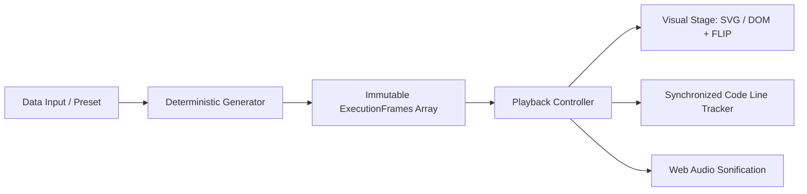

<div align="center">

# ⚡ StepDSA

### The Modern Interactive DSA Learning Platform & Time-Travel Visualizer

[](LICENSE)
[](.github/workflows/ci.yml)
[](CONTRIBUTING.md)
[](https://www.typescriptlang.org/)
[](https://react.dev/)
[](https://tailwindcss.com/)

**Interactive Textbook** &nbsp;•&nbsp; **Deterministic Step Visualizer** &nbsp;•&nbsp; **DSA Playground**

[Explore Live Demo](https://ThanhNguyxnOrg.github.io/StepDSA/) · [Report Bug](https://github.com/ThanhNguyxnOrg/StepDSA/issues) · [Request Algorithm](https://github.com/ThanhNguyxnOrg/StepDSA/issues/new?template=new_algorithm.md)

</div>

---

## 🌟 Why StepDSA?

Most existing algorithm visualizers suffer from the same fundamental flaws:
1. **Passive Watching:** Users sit through non-scrubbable, imperative animation loops without truly building intuition.
2. **Disconnected Theory:** Visualization is separated from the code and mathematical invariants that actually matter in technical interviews and computer science curricula.
3. **Dated Aesthetics:** Cluttered interfaces with 2010s canvas elements and confusing modal settings.

**StepDSA solves this by combining three core modalities into a single developer workbench:**
* 📖 **Interactive Narrative Textbook:** Clear mental models, invariant breakdowns, and Big-O proofs before showing the code.
* ⏱️ **Deterministic Time-Travel Engine:** Instant scrubbable timeline with zero-lag reverse stepping (`←`), speed controls (`0.25x` to `2x`), and annotated execution milestones.
* 💻 **Synchronized Multi-Language Code:** Live execution line tracking across **Python, TypeScript, C++, Java, and Pseudocode**.
* 🧪 **Interactive Playground & Edge Cases:** Stress-test algorithms with custom arrays, reverse-sorted inputs, duplicates, and worst-case patterns.
* 📐 **2.5D Isometric Mode:** Stylized spatial projection toggle bringing depth and elegance to data structures.
* 🎵 **Auditory Sonification:** Web Audio API synth tones mapped to element values—hear entropy decrease in real time as arrays sort.

---

## 🏗️ Architecture & Core Engine

StepDSA is built upon the **Deterministic Snapshot Timeline Pattern**:



Every algorithm is implemented as a self-contained, typed **`AlgorithmModule`**:

```typescript
export interface AlgorithmModule<TInput, TState> {
  id: string;
  title: string;
  category: 'sorting' | 'searching' | 'arrays' | 'trees' | 'graphs' | 'dp';
  complexity: { timeBest: string; timeWorst: string; space: string };
  theory: { overview: string; whyItWorks: string; invariant: string };
  codeImplementations: Record<'python' | 'typescript' | 'cpp' | 'java' | 'pseudocode', string>;
  generateTimeline: (input: TInput) => ExecutionFrame<TState>[];
  renderStage: (frame: ExecutionFrame<TState>, projection: '2d' | 'isometric') => React.ReactNode;
}
```

---

## 🗺️ Roadmap & Curriculum Matrix

### 🟢 Tier 1: Core Essentials (Active Milestone)
- [x] **Quicksort:** Lomuto & Hoare partition schemes, pivot dynamics, recursive tree.
- [x] **Mergesort:** Auxiliary buffer visualization, divide-and-conquer recursion tree.
- [x] **Binary Search:** Continuous search-range halving, invariant boundaries `[L...R]`.
- [x] **Two Pointers:** Search space elimination (Container With Most Water, 2-Sum II).
- [x] **Binary Search Tree (BST):** Node insertion, search path, in-order/pre-order traversal.

### 🟡 Tier 2: Graphs & Dynamic Programming
- [ ] **Breadth-First Search (BFS) & Depth-First Search (DFS)**
- [ ] **Dijkstra's Shortest Path:** Min-heap priority queue state & edge relaxation.
- [ ] **Kahn's Topological Sort:** In-degree array updates and DAG dependency resolution.
- [ ] **0/1 Knapsack & Grid Traveler:** 2D DP table matrix computation with back-tracking.

### 🟣 Tier 3: Advanced Trees & Strings
- [ ] **AVL Trees & Red-Black Trees:** Tree balancing & rotations.
- [ ] **Trie (Prefix Tree):** Autocomplete word tree.
- [ ] **A* Pathfinding & Disjoint Set Union (DSU)**

---

## 🚀 Quick Start

### Prerequisites
- Node.js `18.x` or higher
- npm or pnpm

### Local Development

```bash
# 1. Clone repository
git clone https://github.com/ThanhNguyxnOrg/StepDSA.git
cd StepDSA

# 2. Install dependencies
npm install

# 3. Start development server
npm run dev

# 4. Run test suite
npm test
```

---

## 🎨 Design System

StepDSA follows a custom high-contrast dark OLED palette optimized for prolonged study:
* **Background:** Deep OLED Slate (`#0B0F19`)
* **Surfaces:** Elevated Charcoal (`#111827`, `#1F2937`)
* **Accents:** Emerald (`#10B981`), Electric Cyan (`#06B6D4`), Amber Pivot (`#F59E0B`), Rose Collision (`#F43F5E`)
* **Fonts:** `Plus Jakarta Sans` (UI / Prose) + `JetBrains Mono` (Code & Pointers)

For complete token specifications, see [`design-system/stepdsa/MASTER.md`](design-system/stepdsa/MASTER.md).

---

## 🤝 Contributing

Contributions are welcomed and deeply appreciated! Whether adding a new algorithm module, optimizing animation curves, or writing clearer conceptual explanations:

1. Check out our [Contributing Guide](CONTRIBUTING.md).
2. Choose an algorithm from the [Roadmap](#-roadmap--curriculum-matrix) or open an issue.
3. Submit a Pull Request following the [PR Template](.github/pull_request_template.md).

---

## 📄 License

This project is licensed under the MIT License — see the [LICENSE](LICENSE) file for details.
