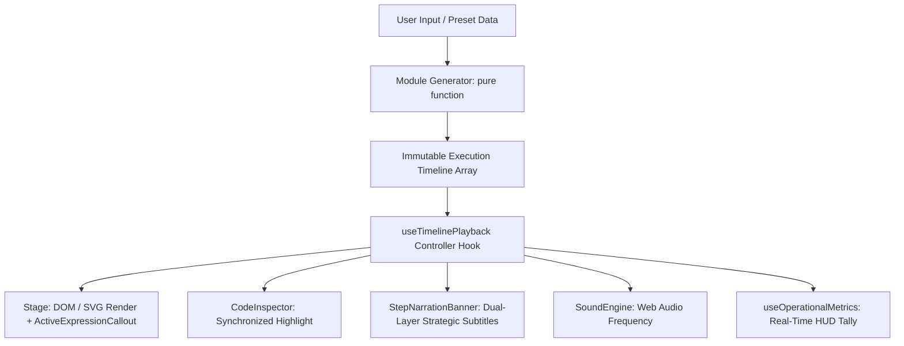
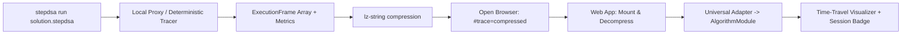

# 🏗️ StepDSA System Architecture

  
  
  
  

StepDSA is an interactive algorithm workbench designed around zero-latency scrubbing, deterministic reproducibility, and pedagogical rigor.

---

## 📐 Core Engineering Principles

1. **Deterministic Snapshots over Stateful Mutators:**
   Traditional visualizers use async `sleep()` loops modifying shared mutable state. StepDSA computes an array of immutable `ExecutionFrame<TState>[]` upfront in pure memory. Scrubbing backwards or jumping to any arbitrary step is instantaneous $\mathcal{O}(1)$ array indexing.

2. **Decoupled Stage Renderers:**
   Visual stages receive `frame.state` as a pure React rendering target. Whether rendered as 2D vertical bars, tree node graphs, or SVG pointers, stage renderers hold zero internal playback state.

3. **Multi-Track Synchronization:**
   Every frame indexes:
   * **Visual Elements:** Values, statuses (`comparing`, `swapping`, `sorted`, `pivot`).
   * **Code Line Tracker:** Synchronized active line across 5 languages.
   * **Pedagogical Narration:** Plain-English and mathematical explanation of the invariant preserved during this step.
   * **Sound Engine:** Frequency tone synthesized from element values.

---

## 🔄 Execution Pipeline

### 🧠 Pedagogical Cognitive Model
StepDSA decouples cognitive load into complementary visual layers inspired by modern EdTech:
- **Macro Layer (Strategy):** Dual-layer subtitles in `StepNarrationBanner` immediately explain the algorithm's high-level intent (e.g. `[🔄 SWAP]`, `[⚡ HASH LOOKUP]`).
- **Micro Layer (Formulas):** Floating `ActiveExpressionCallout` pills render dynamic mathematical checks right on the active elements without requiring mental calculations.
- **Resource HUD:** `OperationalMetricsBar` tallies cumulative comparisons, swaps, accesses, and lookups to contrast against theoretical Big-O curves.
- **Milestone Navigation:** Chapter pins on the scrub track allow jumping directly between algorithmic phases (Partitioning, Recursion, Completion).
- **Auto-Pace Engine:** Intelligent playback pacing automatically slows down during dense mathematical decisions (swaps, tree rotations, partition adjustments) and speeds through routine increments.
- **Command Palette (`⌘K` / `Ctrl+K`):** Instant fuzzy-indexed switcher allowing keyboard navigation across all 162 curriculum modules with categorized domain tags.

---

## 🔗 CLI → Web Trace Bridge

The `stepdsa run` command traces user algorithm code locally, records accumulator metrics (`comparisons`, `swaps`, `accesses`), compresses the snapshot via `lz-string`, and opens the browser with the compressed payload in the URL hash. The web app decompresses the payload on mount, adapts it via the Universal Adapter, cleans the hash with `history.replaceState`, and displays an active session badge.

---

## 🧩 Directory Organization

* **`src/core/`**: Timeline controller, types, and playback logic.
* **`src/modules/`**: Pure algorithm implementations, theory, and stage renderers.
* **`src/components/`**: Modular UI components (stage, player, code inspector, playground, drawer).
* **`src/utils/`**: Web Audio synthesizer, array generators, and formatters.
* **`cli/`**: Standalone zero-backend CLI (`init`, `run`, `trace`) for local algorithm tracing.
* **`docs/`**: Developer guides, CLI manual, and curriculum specifications.

