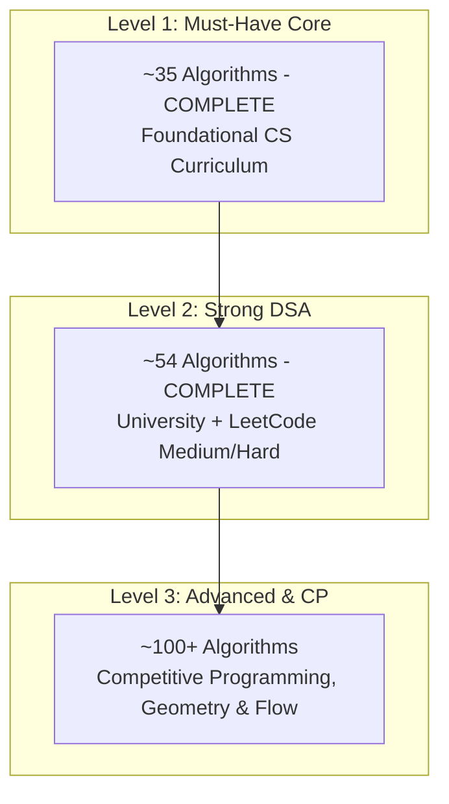

# StepDSA Master Curriculum & Specification (100+ Algorithms)

> **Architectural Mission:**
> Distinct from rudimentary classroom visualizers (such as CSVizTool, which strictly confines itself to Georgia Tech's introductory CS 1332 syllabus), **StepDSA** is architected as a professional **Interactive IDE-Grade Algorithm Workbench**: serving university computer science students, software engineers mastering technical interview patterns (LeetCode patterns), and competitive programmers (ICPC / IOI).

---

## The StepDSA Pedagogical Standard (7-Pillar Contract)

Every algorithm implemented within StepDSA must adhere to the 7 core architectural pillars:

1. **Interactive Stage:** High-performance vector graphics (DOM/SVG/Canvas) supporting both 2D planar layouts and 2.5D Isometric projections.
2. **Hybrid Granularity Stepper:** Dual execution granularities:
   - `Line` (F10 / Step Into): Executes individual CPU instructions (variable assignments, loop increments, conditional evaluations).
   - `Action` (Shift + F10 / Milestone): Fast-forwards to macro-level visual milestones (Swap, Merge, Enqueue, Backtrack, Tree Rotation).
3. **IDE Debugger Pane:** Real-time execution telemetry featuring a concrete **Call Stack** (recursive frame depth `#3, #2, #1`), **Scope Variables** (real-time local/global state tracking), and branch evaluation inspectors (`85 <= 98 -> TRUE`).
4. **Synchronized Multi-Language Code:** Live line-synchronized syntax highlighting across 5 formal representations: **C++** (ICPC Standard), **Python**, **TypeScript**, **Java**, and **Pseudocode**.
5. **Mathematical Invariants & Theoretical Proofs:** In-line invariant status banners and a slide-out Invariant Drawer detailing correctness proofs, asymptotic Big-O complexities, and real-world edge cases.
6. **Web Audio Sonification:** Frequency-synthesized audio feedback (Web Audio API) mapped to element values, memory reads, writes, and partition barriers.
7. **Custom Sandbox & Presets:** User-defined custom inputs (Array, Graph, Tree) alongside preconfigured datasets (Random, Reversed Worst-Case, Nearly Sorted, Few Unique).

---

## Comparative Analysis: CSVizTool (Baseline) vs. StepDSA (Full Spectrum)

| Criteria | CSVizTool (CS 1332 Baseline) | StepDSA (Professional Visualizer) |
|---|---|---|
| **Academic Target** | CS 1332 syllabus (introductory undergraduate) | Full CS Degree + Technical Interviews + ICPC / Competitive Programming |
| **Algorithmic Scope** | Halts at basic graphs; lacks DP, Trie, Advanced Trees, Geometry | Full spectrum: DP (0/1, Unbounded, Bitmask), Strings (KMP, Z, Aho), Advanced Trees, Flow |
| **Execution Mechanics** | Passive animation playback; no line-by-line CPU execution | **IDE-Grade Debugger**: Real Call Stack, Scope Variables, discrete CPU line stepping |
| **Code Synchronization** | Static Java or Pseudocode display only | Real-time line highlight synchronization across C++, Python, TS, Java, Pseudocode |
| **Spatial Visual Modes** | Flat 2D rendering only | 2D planar + 2.5D Isometric + 3D Spatial Partitioning |

---

## Master Curriculum Roadmap (21 Taxonomic Categories A through U)

### A. Searching
- [x] **Linear Search (Sequential Scan)** `[ACTIVE]`
- [x] **Binary Search (Invariant Boundary Halving)** `[ACTIVE]`
- [x] **Search in Rotated Sorted Array (Pivot Invariant Halving)** `[ACTIVE]`
- [x] **Jump Search (Block Hopping O(sqrt(N)))** `[ACTIVE]`
- [x] **Interpolation Search (Uniformly Distributed Probing)** `[ACTIVE]`
- [x] **Exponential Search (Doubling Range Search)** `[ACTIVE]`
- [x] **Ternary Search (Tri-Sectioning O(log3 N))** `[ACTIVE]`
- [x] **Binary Search on Answer Space (Monotonic Predicate Optimization)** `[ACTIVE]`

---

### B. Sorting & Selection
* **Elementary Sorts:**
  - [x] **Bubble Sort (Adjacent Swaps)** `[ACTIVE]`
  - [x] **Selection Sort (Minimum Scan)** `[ACTIVE]`
  - [x] **Insertion Sort (Incremental Build)** `[ACTIVE]`
  - [x] **Cocktail Shaker Sort (Bidirectional Bubble Sort)** `[ACTIVE]`
* **Divide & Conquer:**
  - [x] **Quicksort (Lomuto & Hoare Partitioning)** `[ACTIVE]`
  - [x] **Mergesort (Divide & Conquer Two-Way Merge)** `[ACTIVE]`
  - [x] **Quickselect (k-th Order Statistic / Median of Medians)** `[ACTIVE]`
* **Heap-Based:**
  - [x] **Heapsort (Max-Heap In-Place)** `[ACTIVE]`
* **Non-Comparison Sorts:**
  - [x] **Counting Sort (Frequency Bucket Indexing)** `[ACTIVE]`
  - [x] **Radix Sort (LSD Digit Bucket Passes)** `[ACTIVE]`
  - [x] **Bucket Sort (Scatter-Gather Distribution)** `[ACTIVE]`
* **Advanced & Adaptive Sorts:**
  - [x] **Shellsort (Diminishing Increment Gap Sequence)** `[ACTIVE]`
  - [x] **Timsort (Adaptive Natural Run Merging O(N log N))** `[ACTIVE]`
  - [x] **Introsort (Hybrid Quick / Heap / Insertion Sort O(N log N))** `[ACTIVE]`
* **Educational & Esoteric Sorts:**
  - [x] **Bogosort (Permutation Random Shuffle O(N * N!))** `[ACTIVE]`
  - [x] **Sleep Sort (Thread-Based Timer Scheduling O(max(A) + N))** `[ACTIVE]`
  - [x] **Drop Sort (Lossy Non-Decreasing Extraction O(N))** `[ACTIVE]`
  - [x] **Stooge Sort (Recursive 2/3 Overlapping Segment Sort O(N^2.71))** `[ACTIVE]`

---

### C. Linked Lists (Structures & Operations)
- [x] **Singly Linked List (Insert, Delete, Reverse)** `[ACTIVE]`
- [x] **Doubly Linked List (Bidirectional Pointers)** `[ACTIVE]`
- [x] **Reverse Linked List (In-Place Iterative & Recursive)** `[ACTIVE]`
- [x] **Floyd's Cycle Detection (Tortoise and Hare Fast & Slow Pointers)** `[ACTIVE]`
- [x] **Circular Linked List (Ring Buffer Traversal)** `[ACTIVE]`
- [x] **Middle of the Linked List (Two-Pointer Midpoint Finding)** `[ACTIVE]`
- [x] **Merge Two Sorted Linked Lists (Splice & Merge Pointers O(N + M))** `[ACTIVE]`
- [x] **Remove N-th Node From End of List (Two-Pointer Window O(N))** `[ACTIVE]`
- [x] **Intersection of Two Linked Lists (Pointer Alignment Traversal O(N + M))** `[ACTIVE]`

---

### D. Linear Data Structures (Stack / Queue / Deque)
* **Core Structures:**
  - [x] **Queue (FIFO Operations)** `[ACTIVE]`
  - [x] **Stack (Array-Based & Node-Based Dynamic Implementations)** `[ACTIVE]`
  - [x] **Circular Queue (Modulo Indexing Ring Buffer)** `[ACTIVE]`
  - [x] **Deque (Double-Ended Queue with Head/Tail O(1) Operations)** `[ACTIVE]`
* **Algorithmic Applications:**
  - [x] **Balanced Parentheses (Stack LIFO Syntax Validator)** `[ACTIVE]`
  - [x] **Monotonic Stack (Next Greater Element / Histogram Rectangles)** `[ACTIVE]`
  - [x] **Infix to Postfix Conversion (Dijkstra's Shunting-Yard Algorithm)** `[ACTIVE]`
  - [x] **Postfix Expression Evaluation (Operand Stack Evaluator O(N))** `[ACTIVE]`
  - [x] **Monotonic Queue (Sliding Window Maximum O(N))** `[ACTIVE]`

---

### E. Trees & Priority Queues
* **Binary Tree & Traversals:**
  - [x] **Binary Tree Traversals (Inorder, Preorder, Postorder)** `[ACTIVE]`
  - [x] **Level-Order Traversal (Breadth-First Search Tree)** `[ACTIVE]`
* **Binary Search Tree (BST):**
  - [x] **BST Search & Insertion (Ordered Key Invariant)** `[ACTIVE]`
  - [x] **BST Deletion (Inorder Predecessor / Successor Re-linking O(H))** `[ACTIVE]`
* **Self-Balancing Trees:**
  - [x] **AVL Tree (Self-Balancing Rotations)** `[ACTIVE]`
  - [x] **Red-Black Tree (Color Invariants & Recoloring Rotations O(log N))** `[ACTIVE]`
  - [x] **Splay Tree (Self-Adjusting Zig-Zig & Zig-Zag Heuristics O(log N Amortized))** `[ACTIVE]`
* **Multi-Way & Database Trees:**
  - [ ] 2-3 Tree (Balanced Multi-Way Search Tree)
  - [ ] 2-3-4 Tree (B-Tree Order 4 with Symmetric Splitting)
  - [x] **B-Tree & B+ Tree (High-Fanout Database Block Indexing)** `[ACTIVE]`
* **Heaps & Priority Queues:**
  - [x] **Binary Heap (Min-Heap Insert, Sift-Down, Extract-Min)** `[ACTIVE]`
  - [x] **Max-Heap & Floyd's Linear-Time Build-Heap O(N)** `[ACTIVE]`
* **Specialized & Probabilistic Trees:**
  - [x] **SkipList (Probabilistic Multi-Level Express Lanes)** `[ACTIVE]`
  - [x] **Treap (Cartesian Randomized BST Heap Hybrid O(log N))** `[ACTIVE]`

---

### F. Trie & String Trees
- [x] **Trie (Prefix Search & Autocomplete)** `[ACTIVE]`
- [ ] Radix Tree (Compressed Patricia Trie Edge Compacting)
- [ ] Ternary Search Tree (TST Compact Three-Way Branching)
- [ ] Suffix Tree (Ukkonen's Linear-Time Online Construction)
- [ ] Suffix Array & LCP Array (Kasai's Linear-Time Inversion)

---

### G. Maps & Hashing
- [ ] Hash Map (Separate Chaining with Linked Collision Buckets)
- [ ] Hash Map (Open Addressing: Linear Probing)
- [ ] Hash Map (Quadratic Probing & Double Hashing)
- [ ] Dynamic Rehashing & Amortized Load Factor Resizing
- [ ] Tree Map (Self-Balancing Red-Black Key-Value Dictionary)

---

### H. Graph Traversals & Connectivity
- [x] **Breadth-First Search (BFS Wavefront & Shortest Path)** `[ACTIVE]`
- [x] **Depth-First Search (DFS & Cycle Detection)** `[ACTIVE]`
- [x] **Topological Sort (Kahn's In-Degree Queue Algorithm)** `[ACTIVE]`
- [x] **Connected Components & Flood Fill (Grid & Adjacency Scan)** `[ACTIVE]`
- [x] **Bipartite Graph Verification (2-Coloring via BFS / DFS)** `[ACTIVE]`
- [x] **Topological Sort (DFS Post-Order Finish Times O(V + E))** `[ACTIVE]`

---

### I. Shortest Path Algorithms
- [x] **Dijkstra's Algorithm (Min-Heap Priority Queue Relaxation)** `[ACTIVE]`
- [x] **Bellman-Ford Algorithm (Edge Relaxation & Negative-Cycle Detection)** `[ACTIVE]`
- [x] **Floyd-Warshall Algorithm (All-Pairs Shortest Path Dynamic Programming)** `[ACTIVE]`
- [x] **A* Search Algorithm (Admissible & Consistent Heuristic Pathfinding)** `[ACTIVE]`
- [x] **0-1 BFS (Double-Ended Queue Edge-Weight Shortest Path O(V + E))** `[ACTIVE]`

---

### J. Minimum Spanning Tree (MST) & Disjoint Set
- [x] **Disjoint Set Union (DSU / Union-Find with Path Compression & Union-by-Rank)** `[ACTIVE]`
- [x] **Kruskal's Algorithm (Greedy Edge Sorting + DSU Cycle Elimination)** `[ACTIVE]`
- [x] **Prim's Algorithm (Priority Queue Cut Property MST)** `[ACTIVE]`
- [ ] Boruvka's Algorithm (Parallel Component Contraction)

---

### K. Advanced Graph Algorithms (ICPC & Systems Level)
* **Strongly Connected Components (SCC):**
  - [x] **Tarjan's SCC Algorithm (Low-Link DFS Timestamps & Explicit Stack O(V + E))** `[ACTIVE]`
  - [x] **Kosaraju's Algorithm (Two-Pass Transposed DFS Decomposition O(V + E))** `[ACTIVE]`
* **Bridges & Articulation Points:**
  - [x] **Bridge Finding in Undirected Graphs (DFS Discovery & Low-Point Bounds O(V + E))** `[ACTIVE]`
  - [x] **Articulation Points (Cut Vertices & Root-Degree Checks O(V + E))** `[ACTIVE]`
* **Eulerian & Hamiltonian Paths:**
  - [x] **Hierholzer's Algorithm (Eulerian Path & Circuit Backtracking O(V + E))** `[ACTIVE]`
  - [ ] Hamiltonian Path & Cycle (NP-Complete Backtracking & State Pruning)
* **Network Flow & Bipartite Matching:**
  - [x] **Ford-Fulkerson & Edmonds-Karp (Augmenting Paths via BFS O(V E^2))** `[ACTIVE]`
  - [x] **Dinic's Algorithm (Level Graph & Blocking Flow O(V^2 E))** `[ACTIVE]`
  - [x] **Hopcroft-Karp Algorithm (Maximum Bipartite Matching O(E sqrt(V)))** `[ACTIVE]`
* **Graph Coloring & Transitive Closure:**
  - [x] **Transitive Closure (Warshall's Reachability Matrix O(V^3))** `[ACTIVE]`
  - [x] **Graph Coloring (Greedy Welsh-Powell Algorithm O(V^2 + E))** `[ACTIVE]`

---

### L. String Algorithms & Pattern Matching
* **Pattern Matching:**
  - [x] **Knuth-Morris-Pratt / KMP (Longest Prefix Suffix Failure Function)** `[ACTIVE]`
  - [x] **Rabin-Karp (Rolling Hash Pattern Match)** `[ACTIVE]`
  - [x] **Z-Algorithm (Linear Z-Box Substring Pattern Matching)** `[ACTIVE]`
  - [x] **Naive Brute Force Matching (Slide-and-Compare Baseline O(N * M))** `[ACTIVE]`
  - [x] **Boyer-Moore Algorithm (Bad Character Heuristic O(N / M))** `[ACTIVE]`
  - [x] **Aho-Corasick Algorithm (Dictionary Trie with Failure Links O(N + M + Z))** `[ACTIVE]`
* **Advanced String Algorithms:**
  - [x] **Manacher's Algorithm (Linear-Time Longest Palindromic Substring O(N))** `[ACTIVE]`
  - [x] **Suffix Automaton (SAM Minimal Directed Acyclic Word Graph)** `[ACTIVE]`

---

### M. Dynamic Programming (DP)
* **Fundamental & Linear DP:**
  - [x] **Kadane's Algorithm (Maximum Contiguous Subarray Sum O(N))** `[ACTIVE]`
  - [x] **House Robber (Non-Adjacent Maximum Sum Subsequence)** `[ACTIVE]`
  - [x] **Fibonacci & Climbing Stairs (State Transition & Memoization Foundations)** `[ACTIVE]`
* **Knapsack Family:**
  - [x] **0/1 Knapsack Problem (2D DP Matrix & Backtrack Reconstitution)** `[ACTIVE]`
  - [x] **Coin Change (Fewest Coins DP)** `[ACTIVE]`
  - [x] **Unbounded Knapsack Problem (Repetitive Item Choice 1D DP O(N * W))** `[ACTIVE]`
  - [x] **Subset Sum & Partition Equal Subset Sum (Boolean DP Matrix O(N * S))** `[ACTIVE]`
* **Sequence DP:**
  - [x] **Longest Common Subsequence (LCS 2D DP Table & Backtrack)** `[ACTIVE]`
  - [x] **Longest Increasing Subsequence (LIS Patience Sorting O(N log N))** `[ACTIVE]`
  - [x] **Edit Distance (Levenshtein Distance Matrix Alignment)** `[ACTIVE]`
  - [x] **Longest Palindromic Substring (Expand Around Center / DP)** `[ACTIVE]`
  - [x] **Longest Palindromic Subsequence (Interval Matrix DP O(N^2))** `[ACTIVE]`
* **Grid & Interval DP:**
  - [x] **Unique Paths & Minimum Path Sum in 2D Grid** `[ACTIVE]`
  - [x] **Matrix Chain Multiplication (MCM Optimal Parenthesization O(N^3))** `[ACTIVE]`
  - [x] **Burst Balloons (Reverse Interval DP Decomposition)** `[ACTIVE]`
* **Bitmask & Tree DP:**
  - [x] **Traveling Salesperson Problem (TSP Held-Karp O(2^N * N^2) Bitmask DP)** `[ACTIVE]`
  - [ ] Tree DP (Tree Diameter, Maximum Independent Set, Rerooting Technique)

---

### N. Greedy & Array Techniques
- [x] **Two Pointers Technique (Convergent Pointer Traversal)** `[ACTIVE]`
- [x] **Sliding Window Technique (Fixed & Variable Length Window Invariants)** `[ACTIVE]`
- [x] **Activity Selection / Interval Scheduling (Earliest Deadline First)** `[ACTIVE]`
- [x] **Fractional Knapsack (Value-to-Weight Ratio Greedy Choice O(N log N))** `[ACTIVE]`
- [x] **Huffman Coding (Greedy Min-Heap Optimal Prefix Tree O(N log N))** `[ACTIVE]`
- [x] **Gas Station Circuit (Greedy Cumulative Deficit Check O(N))** `[ACTIVE]`
- [x] **Jump Game (Greedy Maximum Reachable Index)** `[ACTIVE]`
- [x] **Merge Overlapping Intervals (Sort by Start Time Sweep O(N log N))** `[ACTIVE]`

---

### O. Divide & Conquer
- [x] **Mergesort (Two-Way Array Partition & Inversion Count)** `[ACTIVE]`
- [x] **Quicksort (Pivot Partition & Recursive Subarray Sort)** `[ACTIVE]`
- [ ] Closest Pair of Points (O(N log N) Geometric Divide & Conquer)
- [x] **Count Inversions in Array (Modified Mergesort Cross-Inversion Counting O(N log N))** `[ACTIVE]`
- [ ] Strassen's Matrix Multiplication (Sub-Cubic O(N^2.807) Matrix Block Algebra)

---

### P. Backtracking
- [x] **N-Queens Problem (Row-by-Row Constraint Propagation & Diagonal Masks)** `[ACTIVE]`
- [x] **Sudoku Solver (Exact Cover Constraint Backtracking O(9^(N^2)))** `[ACTIVE]`
- [ ] Permutations & Combinations Generator (State-Space Exploration)
- [x] **Subsets / Power Set (Recursive Include/Exclude Decision Tree O(2^N))** `[ACTIVE]`
- [x] **Rat in a Maze (Grid Pathfinding Backtracking O(4^(N^2)))** `[ACTIVE]`
- [x] **Word Search in 2D Grid (Directional DFS Backtracking O(N * 4^L))** `[ACTIVE]`

---

### Q. Recursion & Call Trees
- [x] **Tower of Hanoi (Recursive Call Stack Visualization)** `[ACTIVE]`
- [ ] Mergesort Recursion Call Tree (Visual Frame Depth & Split Tree)
- [ ] Quicksort Partition Tree (Pivot-Selection Tree Topology)
- [ ] Backtracking State-Space Decision Tree Visualizer

---

### R. Number Theory & Mathematics
- [x] **Euclidean Algorithm (Greatest Common Divisor via Modulo)** `[ACTIVE]`
- [x] **Sieve of Eratosthenes (Composite Grid Elimination)** `[ACTIVE]`
- [x] **Fast Binary Modular Exponentiation (Logarithmic Exponent Halving)** `[ACTIVE]`
- [x] **Modular Multiplicative Inverse (Extended Euclidean Algorithm O(log min(A, B)))** `[ACTIVE]`
- [x] **Integer Prime Factorization (Trial Division & Prime Decomposition O(sqrt(N)))** `[ACTIVE]`

---

### S. Bit Manipulation
- [x] **Bitwise Operations Interactive Visualizer (AND, OR, XOR, NOT, Shifts)** `[ACTIVE]`
- [x] **Count Set Bits (Brian Kernighan's Algorithm O(K))** `[ACTIVE]`
- [x] **Single Number & XOR Cancellation Detection O(N)** `[ACTIVE]`
- [ ] Submask Enumeration (Submask Traversal via Bit Tricks)

---

### T. Spatial & Computational Geometry
- [x] **Octree 3D (Spatial Octant Bounding-Box Partitioning)** `[ACTIVE]`
- [x] **Convex Hull (Graham Scan & Cross-Product Orientation O(N log N))** `[ACTIVE]`
- [x] **Line Segment Intersection (Orientation & Cross-Product Verification)** `[ACTIVE]`
- [ ] Point in Polygon Test (Ray Casting & Winding Number)
- [ ] Sweep-Line Algorithm (Bentley-Ottmann Geometric Intersections)

---

### U. Data Structures Taxonomy (Complete Structural Inventory)
* **Linear Structures:**
  - [x] **Singly Linked List (Forward-Linked Pointer Node Chains)** `[ACTIVE]`
  - [x] **Doubly Linked List (Bidirectional Prev/Next Pointer Nodes)** `[ACTIVE]`
  - [x] **Queue (FIFO Array-Backed Circular Buffer & Node-Backed)** `[ACTIVE]`
  - [x] **Circular Linked List (Endless Ring Buffer Traversal)** `[ACTIVE]`
  - [x] **Stack (LIFO Array-Backed & Node-Backed Structures)** `[ACTIVE]`
  - [x] **Deque (Double-Ended Queue with Head/Tail Pointer Buffers)** `[ACTIVE]`
  - [ ] Static Array & Dynamic Array (Contiguous Memory Allocation & Amortized Doubling)
* **Hash-Based Structures:**
  - [ ] Hash Table (Separate Chaining with Dynamic Overflow Buckets)
  - [ ] Hash Table (Open Addressing: Linear Probing, Quadratic Probing, Double Hashing)
  - [ ] TreeMap / Ordered Map (Red-Black Key-Value Search Structure)
* **Trees & Heaps:**
  - [x] **Binary Search Tree (BST Invariant Binary Hierarchy)** `[ACTIVE]`
  - [x] **AVL Tree (Strict Height-Balanced Search Tree)** `[ACTIVE]`
  - [x] **Binary Heap (Min-Heap / Max-Heap Array-Backed Complete Binary Tree)** `[ACTIVE]`
  - [x] **Max-Heap & Floyd's Linear-Time Build-Heap O(N)** `[ACTIVE]`
  - [x] **Level-Order Traversal (Breadth-First Search Tree)** `[ACTIVE]`
  - [x] **Trie (Prefix Character Retrieval Tree)** `[ACTIVE]`
  - [x] **Octree 3D (3D Spatial Octant Decomposition Engine)** `[ACTIVE]`
  - [x] **Red-Black Tree (Relaxed Color-Balanced Search Tree)** `[ACTIVE]`
  - [ ] Binary Tree (Full, Complete, Perfect, Degenerate Topologies)
  - [ ] 2-3 Tree & 2-3-4 Tree (B-Tree Multiway Node Groupings)
  - [x] **B-Tree & B+ Tree (High-Order Clustered & Non-Clustered Storage)** `[ACTIVE]`
  - [x] **Splay Tree (Self-Adjusting Access-Frequency Restructuring)** `[ACTIVE]`
  - [x] **Segment Tree & Lazy Propagation (Range Queries & Updates)** `[ACTIVE]`
  - [x] **Fenwick Tree / Binary Indexed Tree (Prefix Sum Updates in O(log N))** `[ACTIVE]`
  - [x] **Treap (Cartesian Priority Randomized Search Tree)** `[ACTIVE]`
  - [ ] KD-Tree (K-Dimensional Spatial Point Partitioning)
* **Graph & Set Structures:**
  - [x] **Disjoint Set Union (DSU / Union-Find with Path Compression & Rank)** `[ACTIVE]`
  - [x] **Connected Components & Flood Fill (Grid & Adjacency Scan)** `[ACTIVE]`
  - [x] **Bipartite Graph Verification (2-Coloring via BFS / DFS)** `[ACTIVE]`
  - [ ] Adjacency Matrix (Dense V x V Constant-Time Edge Representation)
  - [ ] Adjacency List (Sparse V + E Dynamic Bucket Representation)
  - [ ] Edge List (Flat Weighted Edge Array for Kruskal / Bellman-Ford)
* **Specialized & Advanced Structures:**
  - [x] **SkipList (Probabilistic Multi-Layered Index)** `[ACTIVE]`
  - [ ] Sparse Table (Range Minimum Query RMQ in O(1) Time)
  - [ ] Interval Tree (Augmented 1D Range Overlap Detection)

---

## Scope Allocation across 3 Development Tiers

### Level 1 — Must-Have Core (~35 Modules — Complete)
* **Target Objective:** Comprehensively satisfy all foundational curriculum requirements for 1st & 2nd year university Computer Science (CS1 / CS2).
* **Coverage Scope:**
  - **Sorting (9):** Bubble, Selection, Insertion, Merge, Quick, Heap, Counting, Radix LSD.
  - **Searching (3):** Linear Search, Binary Search, Rotated Sorted Array.
  - **Strings (3):** KMP, Rabin-Karp, Z-Algorithm.
  - **Lists & Linear (5):** Singly Linked List, Doubly Linked List, Queue FIFO, Balanced Parentheses Stack, Monotonic Stack.
  - **Trees & Heaps (5):** Binary Search Tree, AVL Tree, Binary Heap, Tree Traversals, Trie.
  - **Graphs (7):** BFS, DFS, Dijkstra, Bellman-Ford, Prim's MST, Kruskal's MST, Kahn's Topological Sort.
  - **Dynamic Programming (5):** 0/1 Knapsack, LCS, Coin Change, LIS, Edit Distance.
  - **Math & Recursion (3):** Sieve of Eratosthenes, Euclidean GCD, Tower of Hanoi.

### Level 2 — Strong DSA (~54 Modules — Complete)
* **Target Objective:** Technical interview readiness for Big Tech (Google, Meta, Amazon) and ICPC National Contests.
* **Additional Coverage Beyond Level 1:**
  - **Graphs:** Floyd-Warshall, A* Search, DSU / Union-Find.
  - **Dynamic Programming:** Kadane's Algorithm, House Robber, Longest Palindromic Substring.
  - **Greedy & Array Techniques:** Two Pointers, Sliding Window, Activity Selection.
  - **Linked Lists:** Reverse Linked List, Floyd's Cycle Detection.
  - **Backtracking:** N-Queens.
  - **Math & Bit Manipulation:** Fast Binary Exponentiation, Bitwise Operations Visualizer.
  - **Spatial:** Octree 3D.

### Level 3 — Advanced & Competitive Programming (~100+ Modules)
* **Target Objective:** ICPC Regional / World Finals competitive readiness and high-performance systems engineering.
* **Additional Coverage:**
  - **Network Flow:** Dinic's Algorithm, Edmonds-Karp, Min-Cost Max-Flow.
  - **Bipartite Matching:** Hopcroft-Karp Bipartite Matching.
  - **Advanced Trees:** Heavy-Light Decomposition (HLD), Centroid Decomposition, Treap, B-Tree, KD-Tree.
  - **Advanced Queries:** Mo's Algorithm, Sparse Table RMQ O(1).
  - **Geometry:** Convex Hull (Graham Scan), Sweep-Line, Closest Pair of Points.
  - **Advanced Mathematics:** Fast Fourier Transform (FFT / NTT).

---

## Current StepDSA Implementation Status (133 Active Modules)

### Sorting & Selection (18 modules) — 100% COMPLETE
1. [Quicksort (Lomuto Partition)](../src/modules/sorting/quicksort.tsx)
2. [Mergesort (Divide & Conquer)](../src/modules/sorting/mergesort.tsx)
3. [Insertion Sort (Incremental Build)](../src/modules/sorting/insertionSort.tsx)
4. [Selection Sort (Minimum Scan)](../src/modules/sorting/selectionSort.tsx)
5. [Bubble Sort (Adjacent Swaps)](../src/modules/sorting/bubbleSort.tsx)
6. [Counting Sort (Frequency Bucket Indexing)](../src/modules/sorting/countingSort.tsx)
7. [Radix Sort LSD (Digit Bucket Passes)](../src/modules/sorting/radixSort.tsx)
8. [Heapsort (Max-Heap In-Place)](../src/modules/sorting/heapsort.tsx)
9. [Cocktail Shaker Sort (Bidirectional Bubble Sort)](../src/modules/sorting/cocktailShakerSort.tsx)
10. [Quickselect (k-th Order Statistic)](../src/modules/sorting/quickselect.tsx)
11. [Shellsort (Diminishing Increment Gap)](../src/modules/sorting/shellsort.tsx)
12. [Bucket Sort (Scatter-Gather Distribution)](../src/modules/sorting/bucketSort.tsx)
13. [Bogosort (Permutation Random Shuffle)](../src/modules/sorting/bogosort.tsx)
14. [Drop Sort (Lossy Non-Decreasing Extraction)](../src/modules/sorting/dropSort.tsx)
15. [Stooge Sort (Recursive 2/3 Trisection Sort)](../src/modules/sorting/stoogeSort.tsx)
16. [Sleep Sort (Thread-Based Timer Scheduling)](../src/modules/sorting/sleepSort.tsx)
17. [Introsort (Hybrid Quick / Heap / Insertion Sort)](../src/modules/sorting/introsort.tsx)
18. [Timsort (Adaptive Natural Run Merging)](../src/modules/sorting/timsort.tsx)

### Searching (8 modules) — 100% COMPLETE
19. [Linear Search (Sequential Scan)](../src/modules/searching/linearSearch.tsx)
20. [Binary Search (Boundary Halving)](../src/modules/searching/binarySearch.tsx)
21. [Search in Rotated Sorted Array](../src/modules/searching/rotatedSortedArray.tsx)
22. [Jump Search (Block Hopping O(√N))](../src/modules/searching/jumpSearch.tsx)
23. [Interpolation Search (Probing O(log log N))](../src/modules/searching/interpolationSearch.tsx)
24. [Exponential Search (Doubling Range)](../src/modules/searching/exponentialSearch.tsx)
25. [Ternary Search (Tri-Sectioning O(log3 N))](../src/modules/searching/ternarySearch.tsx)
26. [Binary Search on Answer Space (Monotonic Predicate)](../src/modules/searching/binarySearchAnswer.tsx)

### Strings & Pattern Matching (8 modules)
27. [KMP Pattern Search (Knuth-Morris-Pratt)](../src/modules/strings/kmpSearch.tsx)
28. [Rabin-Karp (Rolling Hash Match)](../src/modules/strings/rabinKarp.tsx)
29. [Z-Algorithm (Linear Z-Box Match)](../src/modules/strings/zAlgorithm.tsx)
30. [Naive Brute Force Matching](../src/modules/strings/naiveSearch.tsx)
31. [Boyer-Moore Algorithm (Bad Character Heuristic)](../src/modules/strings/boyerMoore.tsx)
32. [Manacher's Algorithm (Linear-Time Longest Palindrome)](../src/modules/strings/manacher.tsx)
33. [Aho-Corasick Algorithm (Dictionary Trie with Failure Links)](../src/modules/strings/ahoCorasick.tsx)
34. [Suffix Automaton / SAM (Minimal Directed Acyclic Word Graph)](../src/modules/strings/suffixAutomaton.tsx)

### Stacks & Queues (9 modules) — 100% COMPLETE
34. [Balanced Parentheses (Stack LIFO)](../src/modules/stack/balancedParentheses.tsx)
35. [Queue (FIFO Operations)](../src/modules/stack/queueVisualizer.tsx)
36. [Monotonic Stack (Next Greater Element)](../src/modules/stack/monotonicStack.tsx)
37. [Stack (LIFO Dynamic Operations)](../src/modules/stack/stackVisualizer.tsx)
38. [Circular Queue (Ring Buffer Modulo)](../src/modules/stack/circularQueue.tsx)
39. [Deque (Double-Ended Queue)](../src/modules/stack/dequeVisualizer.tsx)
40. [Dijkstra's Shunting-Yard (Infix to Postfix)](../src/modules/stack/shuntingYard.tsx)
41. [Postfix Expression Evaluation (Operand Stack)](../src/modules/stack/postfixEvaluation.tsx)
42. [Sliding Window Maximum (Monotonic Deque)](../src/modules/stack/slidingWindowMax.tsx)

### Linked Lists (9 modules) — 100% COMPLETE
43. [Singly Linked List (Pointers & Mutations)](../src/modules/linkedList/singlyLinkedList.tsx)
44. [Doubly Linked List (Bidirectional Pointers)](../src/modules/linkedList/doublyLinkedList.tsx)
45. [Reverse Linked List (In-Place)](../src/modules/linkedList/reverseLinkedList.tsx)
46. [Floyd's Cycle Detection (Fast & Slow)](../src/modules/linkedList/floydCycleDetection.tsx)
47. [Circular Linked List (Ring Buffer)](../src/modules/linkedList/circularLinkedList.tsx)
48. [Middle of the Linked List (Two-Pointer)](../src/modules/linkedList/middleLinkedList.tsx)
49. [Merge Two Sorted Linked Lists](../src/modules/linkedList/mergeTwoLists.tsx)
50. [Remove N-th Node From End](../src/modules/linkedList/removeNthFromEnd.tsx)
51. [Intersection of Two Linked Lists](../src/modules/linkedList/intersectionLinkedList.tsx)

### Trees & Advanced Hierarchies (17 modules)
52. [Binary Search Tree (BST Construction)](../src/modules/trees/bst.tsx)
53. [BST Deletion (Inorder Successor Re-linking)](../src/modules/trees/bstDelete.tsx)
54. [AVL Tree (Self-Balancing Rotations)](../src/modules/trees/avlTree.tsx)
55. [Binary Tree Traversals (Inorder, Preorder, Postorder)](../src/modules/trees/treeTraversals.tsx)
56. [Trie (Prefix Search & Autocomplete)](../src/modules/trees/trie.tsx)
57. [Binary Heap (Min-Heap Priority Queue)](../src/modules/trees/binaryHeap.tsx)
58. [Level-Order Traversal (BFS Tree)](../src/modules/trees/levelOrderTraversal.tsx)
59. [Max-Heap & Floyd's Build-Heap O(N)](../src/modules/trees/maxHeap.tsx)
60. [Segment Tree (Range Sum Query & Updates)](../src/modules/trees/segmentTree.tsx)
61. [Octree 3D (Spatial Octant Partitioning)](../src/modules/trees/octree3d.tsx)
62. [Huffman Coding (Greedy Min-Heap Prefix Tree)](../src/modules/trees/huffmanCoding.tsx)
63. [Fenwick Tree / Binary Indexed Tree (Prefix Sums)](../src/modules/trees/fenwickTree.tsx)
64. [Splay Tree (Self-Adjusting Zig-Zig & Zig-Zag Heuristics)](../src/modules/trees/splayTree.tsx)
65. [Treap (Cartesian Randomized BST & Heap Hybrid)](../src/modules/trees/treap.tsx)
66. [Red-Black Tree (Color Invariants & Recoloring Rotations)](../src/modules/trees/redBlackTree.tsx)
67. [B-Tree (Order-M Balanced Multi-Way Disk Indexing)](../src/modules/trees/bTree.tsx)
68. [SkipList (Probabilistic Multi-Level Express Lanes)](../src/modules/trees/skipList.tsx)

### Graphs & Network Connectivity (24 modules)
69. [BFS Wavefront (Queue Shortest Path)](../src/modules/graphs/bfsTraversal.tsx)
70. [DFS Traversal (Call Stack & Cycle Detection)](../src/modules/graphs/dfsTraversal.tsx)
71. [Topological Sort (Kahn's In-Degree DAG)](../src/modules/graphs/topologicalSort.tsx)
72. [Topological Sort (DFS Post-Order Finish Times)](../src/modules/graphs/topologicalSortDFS.tsx)
73. [Dijkstra's Algorithm (Min-Heap Shortest Path)](../src/modules/graphs/dijkstra.tsx)
74. [Bellman-Ford (Negative Weights & Cycles)](../src/modules/graphs/bellmanFord.tsx)
75. [Floyd-Warshall (All-Pairs Shortest Path DP)](../src/modules/graphs/floydWarshall.tsx)
76. [A* Search (Heuristic Pathfinding)](../src/modules/graphs/aStarSearch.tsx)
77. [Kruskal's MST (DSU Edge Sorting)](../src/modules/graphs/kruskalMST.tsx)
78. [Prim's Algorithm (Minimum Spanning Tree)](../src/modules/graphs/primMST.tsx)
79. [Disjoint Set Union (DSU / Union-Find)](../src/modules/graphs/dsu.tsx)
80. [Bipartite Graph Verification (2-Coloring)](../src/modules/graphs/bipartiteCheck.tsx)
81. [Connected Components & Flood Fill (Grid)](../src/modules/graphs/floodFill.tsx)
82. [0-1 BFS (Double-Ended Queue Shortest Path)](../src/modules/graphs/zeroOneBFS.tsx)
83. [Tarjan's SCC Algorithm (Low-Link DFS)](../src/modules/graphs/tarjanSCC.tsx)
84. [Bridge Finding in Undirected Graphs (DFS Cut-Edges)](../src/modules/graphs/bridgeFinding.tsx)
85. [Articulation Points (Cut Vertices & Root-Degree Checks)](../src/modules/graphs/articulationPoints.tsx)
86. [Kosaraju's Algorithm (Two-Pass Transposed DFS)](../src/modules/graphs/kosaraju.tsx)
87. [Transitive Closure (Warshall's Reachability Matrix)](../src/modules/graphs/transitiveClosure.tsx)
88. [Graph Coloring (Greedy Welsh-Powell Algorithm)](../src/modules/graphs/graphColoring.tsx)
89. [Hierholzer's Algorithm (Eulerian Path & Circuit Backtracking)](../src/modules/graphs/hierholzer.tsx)
90. [Ford-Fulkerson & Edmonds-Karp (BFS Augmenting Paths)](../src/modules/graphs/edmondsKarp.tsx)
91. [Dinic's Algorithm (Level Graph & Blocking Flow)](../src/modules/graphs/dinic.tsx)
92. [Hopcroft-Karp Algorithm (Maximum Bipartite Matching)](../src/modules/graphs/hopcroftKarp.tsx)

### Dynamic Programming (16 modules)
93. [Kadane's Algorithm (Max Subarray Sum)](../src/modules/dp/kadanesAlgorithm.tsx)
94. [House Robber (Non-Adjacent Max Sum)](../src/modules/dp/houseRobber.tsx)
95. [Longest Common Subsequence (LCS)](../src/modules/dp/lcs.tsx)
96. [Coin Change (Fewest Coins DP)](../src/modules/dp/coinChange.tsx)
97. [Longest Increasing Subsequence (LIS)](../src/modules/dp/lis.tsx)
98. [Edit Distance (Levenshtein Distance)](../src/modules/dp/editDistance.tsx)
99. [0/1 Knapsack Problem (2D DP Matrix)](../src/modules/dp/knapsack.tsx)
100. [Subset Sum Problem (Boolean DP Matrix)](../src/modules/dp/subsetSum.tsx)
101. [Unbounded Knapsack Problem (1D DP)](../src/modules/dp/unboundedKnapsack.tsx)
102. [Longest Palindromic Substring](../src/modules/dp/longestPalindromicSubstring.tsx)
103. [Fibonacci & Climbing Stairs](../src/modules/dp/climbingStairs.tsx)
104. [Unique Paths in 2D Grid](../src/modules/dp/uniquePaths.tsx)
105. [Longest Palindromic Subsequence (Interval DP)](../src/modules/dp/lps.tsx)
106. [Matrix Chain Multiplication (Interval DP)](../src/modules/dp/matrixChainMultiplication.tsx)
107. [Traveling Salesperson Problem (TSP Held-Karp Bitmask DP)](../src/modules/dp/tspHeldKarp.tsx)
108. [Burst Balloons (Interval Matrix DP Decomposition)](../src/modules/dp/burstBalloons.tsx)

### Greedy & Array Techniques (12 modules)
109. [Two Pointers Technique](../src/modules/arrays/twoPointers.tsx)
110. [Sliding Window Technique](../src/modules/arrays/slidingWindow.tsx)
111. [Activity Selection / Interval Scheduling](../src/modules/arrays/activitySelection.tsx)
112. [Jump Game (Greedy Reachable Frontier)](../src/modules/arrays/jumpGame.tsx)
113. [Merge Overlapping Intervals](../src/modules/arrays/mergeIntervals.tsx)
114. [Fractional Knapsack (Greedy Density Sort)](../src/modules/arrays/fractionalKnapsack.tsx)
115. [Gas Station Circuit (Greedy Cumulative Deficit)](../src/modules/arrays/gasStation.tsx)
116. [Subsets / Power Set (Include/Exclude Backtracking)](../src/modules/arrays/subsets.tsx)
117. [Rat in a Maze (Grid Pathfinding Backtracking)](../src/modules/arrays/ratInAMaze.tsx)
118. [Count Inversions in Array (Modified Mergesort)](../src/modules/arrays/countInversions.tsx)
119. [Word Search in 2D Grid (Directional DFS Backtracking)](../src/modules/arrays/wordSearch.tsx)
120. [Sudoku Solver (Exact Cover Constraint Backtracking)](../src/modules/arrays/sudokuSolver.tsx)

### Spatial & Computational Geometry (2 modules)
121. [Convex Hull (Graham Scan & Cross-Product Orientation)](../src/modules/geometry/convexHull.tsx)
122. [Line Segment Intersection (Orientation & Cross-Product Verification)](../src/modules/geometry/lineIntersection.tsx)

### Number Theory & Math (5 modules)
123. [Sieve of Eratosthenes (Prime Grid)](../src/modules/math/sieveOfEratosthenes.tsx)
124. [Euclidean Algorithm (GCD)](../src/modules/math/euclideanGcd.tsx)
125. [Extended Euclidean Algorithm (Bezout & Inverse)](../src/modules/math/extendedGcd.tsx)
126. [Fast Binary Exponentiation](../src/modules/math/binaryExponentiation.tsx)
127. [Integer Prime Factorization (Trial Division & Prime Decomposition)](../src/modules/math/primeFactorization.tsx)

### Recursion & Backtracking (2 modules)
128. [Tower of Hanoi (Recursive Call Stack)](../src/modules/math/towerOfHanoi.tsx)
129. [N-Queens Problem (Backtracking)](../src/modules/math/nQueens.tsx)

### Bit Manipulation (3 modules)
130. [Bitwise Operations Visualizer](../src/modules/math/bitwiseOperations.tsx)
131. [Count Set Bits (Brian Kernighan's Algorithm)](../src/modules/math/countSetBits.tsx)
132. [Single Number & XOR Cancellation Detection](../src/modules/math/singleNumber.tsx)

### Multi-Way & Hierarchical Search (1 module)
133. [B-Tree & SkipList Multi-Level Indexing](../src/modules/trees/bTree.tsx)

