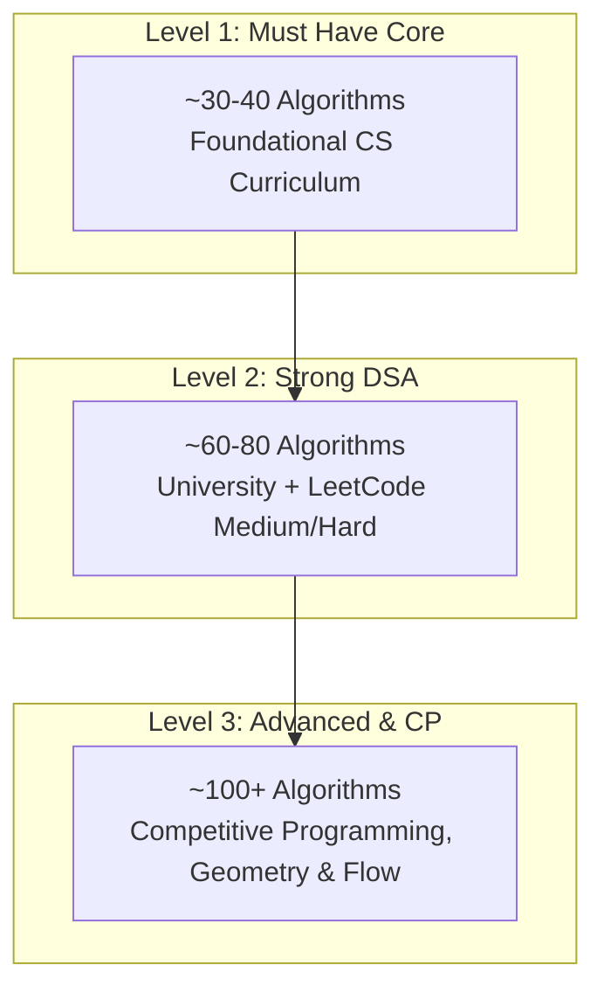

# 🗺️ StepDSA Master Curriculum & Specification (100+ Algorithms)

> **Architectural Mission:**  
> Khác biệt với các visualizer giảng đường đơn thuần (như CSVizTool vốn chỉ gói gọn trong giáo trình CS 1332 của Georgia Tech), **StepDSA** được thiết kế như một **Interactive IDE-Grade Algorithm Workbench** toàn diện: phục vụ từ sinh viên CS đại học, kỹ sư ôn phỏng vấn Big Tech (LeetCode patterns), đến lập trình viên thi đấu (ICPC / Competitive Programming).

---

## 💎 The StepDSA Pedagogical Standard (7-Pillar Contract)
Mỗi thuật toán trong StepDSA khi được triển khai bắt buộc phải đáp ứng đủ 7 trụ cột:
1. **Interactive Stage:** Đồ họa vector mượt mà (DOM/SVG/Canvas) hỗ trợ cả chế độ 2D phẳng và 2.5D Isometric.
2. **Hybrid Granularity Stepper:** Chế độ kép độc quyền:
   - `Line` (F10 / Step Into): Chạy từng dòng lệnh CPU (gán biến, kiểm tra điều kiện rẽ nhánh).
   - `Action` (Shift + F10 / Milestone): Nhảy thẳng đến sự kiện trực quan lớn (Swap, Merge, Enqueue, Backtrack).
3. **IDE Debugger Pane:** Hiển thị **Call Stack** (khung hàm đệ quy `#3, #2, #1`), **Scope Variables** (theo dõi biến cục bộ thời gian thực), và bộ đánh giá biểu thức rẽ nhánh (`85 <= 98 -> TRUE`).
4. **Synchronized Multi-Language Code:** Đồng bộ line highlight trực tiếp giữa 5 ngôn ngữ: **C++** (ICPC Standard), **Python**, **TypeScript**, **Java**, và **Pseudocode**.
5. **Mathematical Invariant & Theory:** Banner thuyết minh cùng dòng và Invariant Drawer phân tích chứng minh tính đúng đắn, Big-$\mathcal{O}$, và cạm bẫy thực tế.
6. **Web Audio Sonification:** Bộ phát âm thanh Web Audio Synth tương ứng với giá trị phần tử và thao tác truy cập bộ nhớ.
7. **Custom Sandbox & Presets:** Cho phép nhập dữ liệu tùy ý (Custom Array/Graph/Tree) hoặc chọn presets (Random, Reversed Worst-case, Nearly Sorted, Few Unique).

---

## 📊 Phân tích So sánh: CSVizTool (Baseline) vs. StepDSA (Full Spectrum)

| Tiêu chí | CSVizTool (CS 1332 Baseline) | StepDSA (Professional Visualizer) |
|---|---|---|
| **Mục tiêu học thuật** | Giáo trình CS 1332 (nhập môn) | Đại học toàn diện + Phỏng vấn + ICPC/CP |
| **Độ sâu thuật toán** | Dừng ở đồ thị cơ bản, thiếu hẳn DP, Trie, Tree nâng cao, Geometry | Bao phủ đầy đủ DP (0/1, Unbounded, Bitmask), String (KMP, Z, Aho), Advanced Trees, Flow |
| **Cơ chế chạy code** | Xem animation thụ động, không có code chạy từng dòng | **IDE-Grade Debugger**: Call Stack thật, Scope Variables, Step từng dòng CPU |
| **Đồng bộ code** | Chỉ hiển thị Java hoặc Pseudocode tĩnh | Đồng bộ thời gian thực C++, Python, TS, Java, Pseudocode |
| **Chế độ quan sát** | 2D phẳng | 2D + 2.5D Isometric + 3D Spatial Partitioning |

---

## 🏛️ Master Curriculum Roadmap (20 Nhóm Phân Loại A → T)

### A. Searching
- [x] **Linear Search (Sequential Scan)** `[ACTIVE]`
- [x] **Binary Search (Invariant Boundary Halving)** `[ACTIVE]`
- [ ] Jump Search
- [ ] Interpolation Search
- [ ] Exponential Search
- [ ] Ternary Search
- [ ] Binary Search on Answer Space (Chặt nhị phân kết quả)

---

### B. Sorting & Selection
* **Elementary (Cơ bản):**
  - [x] **Bubble Sort (Adjacent Swaps)** `[ACTIVE]`
  - [x] **Selection Sort (Minimum Scan)** `[ACTIVE]`
  - [x] **Insertion Sort (Incremental Build)** `[ACTIVE]`
  - [ ] Cocktail Shaker Sort
* **Divide & Conquer (Chia để trị):**
  - [x] **Quicksort (Lomuto & Hoare Partition)** `[ACTIVE]`
  - [x] **Mergesort (Divide & Conquer)** `[ACTIVE]`
  - [ ] Quickselect ($k^{\text{th}}$ Order Statistic)
* **Heap:**
  - [ ] Heapsort
* **Non-Comparison (Không so sánh):**
  - [ ] Counting Sort
  - [ ] Radix Sort (LSD Radix Sort & MSD Radix Sort)
  - [ ] Bucket Sort
* **Advanced / Practical:**
  - [ ] Shell Sort
  - [ ] Tim Sort (Timsort Run Merging)
  - [ ] Intro Sort
* **Educational & Esoteric Sorts (Fun / Parody):**
  - [ ] Bogo Sort (Permutation Shuffle)
  - [ ] Sleep Sort (Multi-threaded timer scheduling)
  - [ ] Drop Sort
  - [ ] Miracle Sort
  - [ ] Fred Sort

---

### C. Linked Lists (Structures & Operations)
- [x] **Singly Linked List (Insert, Delete, Reverse)** `[ACTIVE]`
- [ ] Doubly Linked List
- [ ] Circular Linked List
- [ ] Reverse Linked List (In-place Iterative & Recursive)
- [ ] Floyd's Cycle Detection (Fast & Slow Pointers)
- [ ] Find Middle of Linked List
- [ ] Merge Two Sorted Linked Lists
- [ ] Remove N-th Node From End of List
- [ ] Intersection of Two Linked Lists

---

### D. Linear Data Structures (Stack / Queue / Deque)
* **Core Structures:**
  - [ ] Stack (Array-based & LinkedList-based)
  - [ ] Queue (Array-based & LinkedList-based)
  - [ ] Circular Queue
  - [ ] Deque (Double-Ended Queue)
* **Algorithmic Applications:**
  - [x] **Balanced Parentheses (Stack LIFO Validator)** `[ACTIVE]`
  - [ ] Infix to Postfix Conversion (Shunting Yard)
  - [ ] Postfix Expression Evaluation
  - [ ] Monotonic Stack (Next Greater Element)
  - [ ] Monotonic Queue (Sliding Window Maximum)

---

### E. Trees & Priority Queues
* **Binary Tree & Traversals:**
  - [ ] Preorder, Inorder, Postorder Traversals (Recursive & Iterative)
  - [ ] Level Order Traversal (BFS Tree)
* **Binary Search Tree (BST):**
  - [x] **BST Search & Insertion** `[ACTIVE]`
  - [ ] BST Deletion (Inorder Predecessor / Successor)
* **Self-Balancing Trees:**
  - [ ] AVL Tree (LL, RR, LR, RL Rotations)
  - [ ] Red-Black Tree (Color balancing & rotations)
  - [ ] Splay Tree (Self-adjusting zig-zig / zig-zag)
* **Multiway & B-Trees:**
  - [ ] 2-3 Tree
  - [ ] 2-3-4 Tree
  - [ ] B-Tree / B+ Tree (Database Indexing Model)
* **Heaps & Priority Queues:**
  - [x] **Binary Heap (Min-Heap Insert, Sift-Down, Extract-Min)** `[ACTIVE]`
  - [ ] Max-Heap & Build-Heap $\mathcal{O}(N)$ Floyd Algorithm

* **SkipList & Specialized Trees:**
  - [ ] SkipList (Probabilistic multi-level index)
  - [ ] 2-4 Tree (Balanced Multi-way Tree)

---

### F. Trie & String Trees
- [x] **Trie (Prefix Search & Autocomplete)** `[ACTIVE]`
- [ ] Radix Tree (Compressed Patricia Trie)
- [ ] Ternary Search Tree (TST)
- [ ] Suffix Tree (Ukkonen's Algorithm)
- [ ] Suffix Array & LCP Array (Kasai's Algorithm)

---

### G. Maps & Hashing
- [ ] HashMap (Separate Chaining)
- [ ] HashMap (Open Addressing: Linear Probing)
- [ ] HashMap (Quadratic Probing & Double Hashing)
- [ ] Rehashing & Dynamic Table Resizing
- [ ] TreeMap (Self-Balancing Red-Black Key-Value Map)

---

### H. Graph Traversals & Connectivity
- [x] **Breadth-First Search (BFS Wavefront & Shortest Path)** `[ACTIVE]`
- [x] **Depth-First Search (DFS & Cycle Detection)** `[ACTIVE]`
- [ ] Connected Components & Flood Fill
- [ ] Bipartite Graph Verification (2-Coloring BFS/DFS)
- [x] **Topological Sort (Kahn's In-Degree Queue Algorithm)** `[ACTIVE]`
- [ ] Topological Sort (DFS Post-Order Finish Times)

---

### I. Shortest Path Algorithms
- [x] **Dijkstra's Algorithm (Min-Heap Priority Queue)** `[ACTIVE]`
- [ ] Bellman-Ford Algorithm (Negative Weight Cycle Detection)
- [ ] Floyd-Warshall Algorithm (All-Pairs Shortest Path DP)
- [ ] A* Search Algorithm (Heuristic Pathfinding)
- [ ] 0-1 BFS (Double-Ended Queue Shortest Path)

---

### J. Minimum Spanning Tree (MST) & Disjoint Set
- [ ] Disjoint Set Union (DSU / Union-Find with Path Compression & Rank/Size)
- [ ] Kruskal's Algorithm (Edge Sorting + DSU)
- [ ] Prim's Algorithm (Priority Queue Cut Property)
- [ ] Borůvka's Algorithm

---

### K. Advanced Graph Algorithms (ICPC Level)
* **Strongly Connected Components (SCC):**
  - [ ] Tarjan's SCC Algorithm (Low-Link values & Stack)
  - [ ] Kosaraju's 2-Pass DFS Algorithm
* **Bridges & Articulation Points:**
  - [ ] Bridge Finding in Undirected Graphs
  - [ ] Articulation Points (Cut Vertices)
* **Eulerian & Hamiltonian:**
  - [ ] Hierholzer's Algorithm (Euler Path & Circuit)
  - [ ] Hamiltonian Path / Cycle
* **Network Flow & Matching:**
  - [ ] Ford-Fulkerson & Edmonds-Karp Max Flow
  - [ ] Dinic's Algorithm (Level Graph & Blocking Flow $\mathcal{O}(V^2 E)$)
  - [ ] Hopcroft-Karp Bipartite Matching ($\mathcal{O}(E \sqrt{V})$)
* **Other:**
  - [ ] Transitive Closure
  - [ ] Graph Coloring (Greedy & Backtracking)

---

### L. String Algorithms & Pattern Matching
* **Pattern Matching:**
  - [ ] Naive Brute Force Matching
  - [ ] KMP (Knuth-Morris-Pratt with $\pi$ / LPS Failure Function)
  - [ ] Z-Algorithm (Z-box substring match)
  - [ ] Rabin-Karp (Rolling Hash)
  - [ ] Boyer-Moore (Bad Character & Good Suffix heuristics)
  - [ ] Aho-Corasick (Multi-Pattern Automaton with Failure Links)
* **Advanced String:**
  - [ ] Manacher's Algorithm (Linear-Time Longest Palindromic Substring)
  - [ ] Suffix Automaton (SAM)

---

### M. Dynamic Programming (DP)
* **Basic & Linear DP:**
  - [ ] Fibonacci & Climbing Stairs (State Transition Basics)
  - [ ] House Robber (Non-adjacent maximum sum)
  - [ ] Kadane's Algorithm (Maximum Subarray Sum)
* **Knapsack Family:**
  - [x] **0/1 Knapsack Problem (2D DP Matrix & Backtrack)** `[ACTIVE]`
  - [ ] Unbounded Knapsack
  - [ ] Coin Change I (Minimum Coins) & Coin Change II (Total Ways)
  - [ ] Subset Sum & Partition Equal Subset Sum
* **Sequence DP:**
  - [x] **Longest Common Subsequence (LCS 2D DP Table & Backtrack)** `[ACTIVE]`
  - [ ] Longest Increasing Subsequence (LIS $\mathcal{O}(N \log N)$ Patience Sorting)
  - [ ] Edit Distance (Levenshtein Distance)
  - [ ] Longest Palindromic Subsequence
* **Grid & Interval DP:**
  - [ ] Unique Paths & Minimum Path Sum in 2D Grid
  - [ ] Matrix Chain Multiplication (MCM)
  - [ ] Burst Balloons
* **Bitmask & Tree DP:**
  - [ ] Traveling Salesperson Problem (TSP Bitmask DP)
  - [ ] Tree DP (Diameter, Independent Set, Rerooting)

---

### N. Greedy Algorithms
- [x] **Two Pointers (Container With Most Water)** `[ACTIVE]`
- [x] **Sliding Window (Max Sum Subarray K)** `[ACTIVE]`
- [ ] Activity Selection / Interval Scheduling
- [ ] Fractional Knapsack
- [ ] Huffman Coding (Greedy Frequency Tree)
- [ ] Gas Station Circuit
- [ ] Jump Game (Greedy Reachability)
- [ ] Merge Overlapping Intervals

---

### O. Divide & Conquer
- [x] **Mergesort** `[ACTIVE]`
- [x] **Quicksort** `[ACTIVE]`
- [ ] Closest Pair of Points ($\mathcal{O}(N \log N)$ Divide & Conquer)
- [ ] Count Inversions in Array
- [ ] Strassen's Matrix Multiplication

---

### P. Backtracking
- [ ] N-Queens Problem
- [ ] Sudoku Solver
- [ ] Permutations & Combinations Generator
- [ ] Subsets (Power Set)
- [ ] Rat in a Maze
- [ ] Word Search in Grid

---

### Q. Recursion & Recursion Tree
- [ ] Tower of Hanoi
- [ ] Mergesort Recursion Call Tree Visualizer
- [ ] Quicksort Recursion Tree Partition Visualizer
- [ ] Backtracking State Space Tree

---

### R. Number Theory & Math
- [ ] Euclidean Algorithm & Extended Euclidean (GCD / Bezout Coefficients)
- [x] **Sieve of Eratosthenes (Prime Grid Elimination)** `[ACTIVE]`
- [ ] Fast Binary Modular Exponentiation ($a^b \pmod m$)
- [ ] Modular Multiplicative Inverse
- [ ] Prime Factorization

---

### S. Bit Manipulation
- [ ] Bitwise Operations Visualizer (AND, OR, XOR, NOT, Shifts)
- [ ] Count Set Bits (Brian Kernighan's Algorithm)
- [ ] Power of Two & Single Number XOR Trick
- [ ] Submask Enumeration

---

### T. Spatial & Computational Geometry
- [x] **Octree 3D (Spatial Octant Partitioning)** `[ACTIVE]`
- [ ] Convex Hull (Graham Scan & Andrew's Monotone Chain)
- [ ] Line Segment Intersection (Orientation & Cross Product)
- [ ] Point in Polygon Test (Ray Casting)
- [ ] Sweep-Line Algorithm

---

### U. Data Structures Taxonomy (Bộ Cấu trúc Dữ liệu Đầy đủ)
* **Linear:**
  - [ ] Static Array & Dynamic Array (Vector / ArrayList)
  - [x] **Singly Linked List** `[ACTIVE]`
  - [ ] Doubly Linked List
  - [ ] Circular Linked List
  - [ ] Stack (Array-backed & Node-backed)
  - [ ] Queue (Array-backed & Node-backed)
  - [ ] Deque (Double-Ended Queue)
* **Hash:**
  - [ ] Hash Table (Separate Chaining with Buckets)
  - [ ] Hash Table (Open Addressing: Linear & Quadratic Probing, Double Hashing)
  - [ ] TreeMap
* **Trees & Heaps:**
  - [ ] Binary Tree (Full, Complete, Perfect)
  - [x] **Binary Search Tree (BST)** `[ACTIVE]`
  - [ ] AVL Tree
  - [ ] Red-Black Tree
  - [x] **Binary Heap (Min-Heap / Max-Heap)** `[ACTIVE]`
  - [x] **Trie (Prefix Tree)** `[ACTIVE]`
  - [ ] 2-3 Tree & 2-3-4 Tree
  - [ ] B-Tree & B+ Tree (Database Indexing)
  - [ ] Splay Tree
  - [ ] Segment Tree & Segment Tree with Lazy Propagation
  - [ ] Fenwick Tree (Binary Indexed Tree / BIT)
  - [ ] Treap (Cartesian Tree)
  - [x] **Octree 3D (Spatial Octant Decomposition)** `[ACTIVE]`
  - [ ] KD-Tree (Multidimensional Spatial Tree)
* **Graphs & Disjoint Sets:**
  - [ ] Adjacency Matrix
  - [ ] Adjacency List
  - [ ] Edge List
  - [ ] Disjoint Set Union (DSU / Union-Find with Rank & Path Compression)
* **Advanced & Specialized:**
  - [ ] SkipList
  - [ ] Sparse Table (RMQ $\mathcal{O}(1)$)
  - [ ] Interval Tree

---

## 🎯 Phân bổ Scope Theo 3 Giai Đoạn Phát Triển (Levels)

### 🏆 Level 1 — Must Have Core (~35 Modules)
* **Mục tiêu:** Đáp ứng trọn vẹn toàn bộ kiến thức năm 1 & năm 2 đại học ngành CNTT/CS.
* **Bao gồm:**
  - Sorting: Bubble, Selection, Insertion, Merge, Quick, Heap, Counting.
  - Searching: Linear, Binary.
  - Lists & Linear: Singly/Doubly Linked List, Stack, Queue, Deque, Balanced Parentheses.
  - Trees: BST, AVL, Min/Max Heap, Tree Traversals.
  - Graphs: BFS, DFS, Dijkstra, Prim, Kruskal, Kahn's Topological Sort.
  - Hashing: Separate Chaining, Linear Probing.
  - Strings: Naive, KMP, Rabin-Karp.
  - DP: Fibonacci, 0/1 Knapsack, LCS, LIS, Coin Change.
  - Recursion: Tower of Hanoi, Recursion Tree.

### 🚀 Level 2 — Strong DSA (~75 Modules)
* **Mục tiêu:** Sẵn sàng cho phỏng vấn Big Tech (Google, Meta, Amazon) và vòng loại ICPC National.
* **Bao gồm thêm:**
  - Graphs: Bellman-Ford, Floyd-Warshall, A*, 0-1 BFS, Tarjan SCC, Kosaraju, Bridges, Articulation Points.
  - Data Structures: Trie, Disjoint Set Union (DSU), Segment Tree, Fenwick Tree (BIT), Splay Tree, Monotonic Stack/Queue.
  - Strings: Z Algorithm, Aho-Corasick, Manacher, Suffix Array.
  - DP: Edit Distance, Matrix Chain Multiplication, Bitmask DP (TSP), Tree DP.
  - Backtracking: N-Queens, Sudoku, Subsets.
  - Math: Sieve of Eratosthenes, Euclidean GCD, Fast Exponentiation.

### 🌟 Level 3 — Advanced & Competitive Programming (~100+ Modules)
* **Mục tiêu:** Kỳ thi ICPC Regional / World Finals, lập trình hệ thống nâng cao.
* **Bao gồm thêm:**
  - Network Flow: Dinic's Algorithm, Edmonds-Karp, Min-Cost Max-Flow.
  - Matching: Hopcroft-Karp Bipartite Matching.
  - Advanced Trees: Heavy-Light Decomposition (HLD), Centroid Decomposition, Treap, B-Tree, KD-Tree, Octree 3D.
  - Advanced Query: Mo's Algorithm, Sparse Table RMQ $\mathcal{O}(1)$.
  - Geometry: Convex Hull (Graham Scan), Sweep-Line, Closest Pair.
  - Advanced Math: Fast Fourier Transform (FFT / NTT).

---

## 📈 Trạng thái Hiện tại của StepDSA (22 Modules Đang Hoạt Động)

1. [Linear Search (Sequential Scan)](../src/modules/searching/linearSearch.tsx) — Searching
2. [Quicksort (Lomuto Partition)](../src/modules/sorting/quicksort.tsx) — Sorting
3. [Mergesort (Divide & Conquer)](../src/modules/sorting/mergesort.tsx) — Sorting
4. [Insertion Sort (Incremental Build)](../src/modules/sorting/insertionSort.tsx) — Sorting
5. [Selection Sort (Minimum Scan)](../src/modules/sorting/selectionSort.tsx) — Sorting
6. [Bubble Sort (Adjacent Swaps)](../src/modules/sorting/bubbleSort.tsx) — Sorting
7. [Binary Search (Boundary Halving)](../src/modules/searching/binarySearch.tsx) — Searching
8. [Two Pointers (Container With Most Water)](../src/modules/arrays/twoPointers.tsx) — Arrays & Pointers
9. [Sliding Window (Max Subarray Sum K)](../src/modules/arrays/slidingWindow.tsx) — Arrays & Pointers
10. [Balanced Parentheses (Stack LIFO)](../src/modules/stack/balancedParentheses.tsx) — Linear DS & Stack
11. [Singly Linked List (Pointers & Mutations)](../src/modules/linkedList/singlyLinkedList.tsx) — Linked Lists
12. [Binary Search Tree (BST Construction)](../src/modules/trees/bst.tsx) — Trees
13. [Binary Heap (Min-Heap Priority Queue)](../src/modules/trees/binaryHeap.tsx) — Priority Queues
14. [Trie (Prefix Search & Autocomplete)](../src/modules/trees/trie.tsx) — Trees & Strings
15. [BFS Wavefront (Queue Shortest Path)](../src/modules/graphs/bfsTraversal.tsx) — Graphs
16. [DFS Traversal (Call Stack & Cycle Detection)](../src/modules/graphs/dfsTraversal.tsx) — Graphs
17. [Topological Sort (Kahn's In-Degree DAG)](../src/modules/graphs/topologicalSort.tsx) — Graphs
18. [Dijkstra's Algorithm (Min-Heap Shortest Path)](../src/modules/graphs/dijkstra.tsx) — Graphs
19. [0/1 Knapsack Problem (2D DP Matrix)](../src/modules/dp/knapsack.tsx) — Dynamic Programming
20. [Longest Common Subsequence (LCS 2D DP)](../src/modules/dp/lcs.tsx) — Dynamic Programming
21. [Sieve of Eratosthenes (Prime Grid)](../src/modules/math/sieveOfEratosthenes.tsx) — Number Theory & Math
22. [Octree 3D (Spatial Octant Partitioning)](../src/modules/trees/octree3d.tsx) — Spatial 3D
