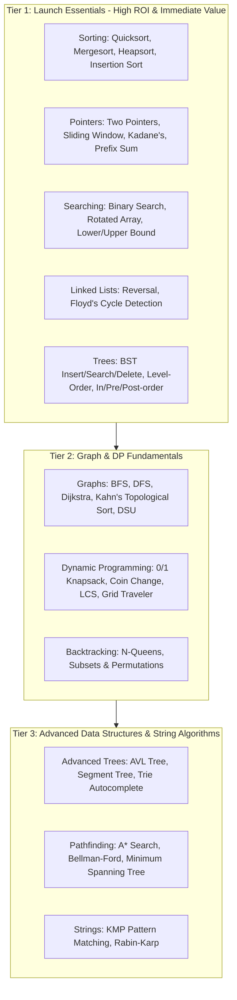

# Research: Pedagogical Effectiveness, Algorithm Prioritization & Visual Techniques for StepDSA

**Project:** StepDSA  
**Date:** 2026-09-26  
**Sources:** Naps et al. (ACM SIGCSE Working Group), Algorithm Visualizer (48k★), VisuAlgo, CS Academy, USFCA, NeetCode/Blind 75 benchmarks.

---

## 1. Pedagogical Research: Why Most Visualizers Fail (and How StepDSA Wins)

Decades of Computer Science Education (CSEd) research—most notably the **Naps et al. Engagement Taxonomy**—prove a striking conclusion:
> *"The pedagogical impact of algorithm visualization depends less on what students see, and far more on what students **do**."*

| Engagement Level | Description | Status in Most Sites | StepDSA Implementation |
| :--- | :--- | :--- | :--- |
| **Level 1: Viewing** | Passive watching of an animation loop. | ❌ Only mode in 80% of tools | Supported, but never default. |
| **Level 2: Responding** | Predicting what happens next ("Which element swaps?"). | ❌ Almost absent | **Interactive Checkpoints:** Optional "Predict next step" popup to test intuition. |
| **Level 3: Changing** | Providing custom datasets, stress-testing edge cases. | ⚠️ Limited to random arrays | **Curated Stress Presets:** All-equal, strictly reversed, nearly sorted, alternating. |
| **Level 4: Constructing** | Assembling structures manually, stepping through logic. | ❌ Missing | **Sandbox Canvas:** Click to build graphs, add tree nodes, drag pointers manually. |

---

## 2. Algorithm Prioritization Matrix (What Algorithms to Build First)

Based on frequency in university curricula (MIT 6.006, Berkeley CS61B) and technical interview roadmaps (NeetCode 150, Blind 75, Striver SDE):

### Detailed Tier 1 Priority Breakdown
1. **Quicksort (Lomuto vs. Hoare Partition):** Shows pivot selection, two-pointer inward scan, and recursive call tree.
2. **Two Pointers (Container With Most Water & 2-Sum II):** Direct visual proof of why eliminating pointer pairs does not miss the optimal solution (visualizing search space pruning).
3. **Binary Search (with Invariant Visualization):** Showing $L$, $R$, $M$ pointers with discarded half shaded in transparent rose `#F43F5E` to explain loop invariants ($L \le R$ vs $L < R$).
4. **Binary Search Tree (BST Operations):** Node insertion with path highlighting, left/right branching logic.
5. **Sliding Window (Max Sum / Longest Substring):** Visual expandable "bracket/lens" sliding across an array.

---

## 3. Best-in-Class Simulation & Animation Techniques

To achieve a modern, fluid visual experience that avoids the clunky canvas rendering of the 2010s:

### 3.1 The FLIP Animation Pattern for Arrays
When sorting or shifting arrays, elements should never "teleport":
* **First:** Calculate element bounding boxes before mutation.
* **Last:** Calculate positions after the swap/shift.
* **Invert:** Compute $\Delta x = x_{\text{first}} - x_{\text{last}}$.
* **Play:** Transition smoothly via `transform: translate3d(Δx, 0, 0)` with spring dynamics (`stiffness: 300, damping: 28`).

### 3.2 Tidy Tree Layout Algorithm (Reingold-Tilford)
* Many tree visualizers draw naive binary trees where deep subtrees collide.
* **Standard:** Implement Buchanan-Reingold-Tilford or D3-hierarchy layout ensuring parent nodes are centered above children and sibling subtrees maintain a strict minimum margin (`24px`).
* Connect nodes with smooth cubic Bezier curves (`M x1 y1 C x1 (y1+y2)/2, x2 (y1+y2)/2, x2 y2`).

### 3.3 Force-Directed Graph Simulation
* For graphs (BFS, DFS, Dijkstra), nodes should settle organically using a spring-electrical model (repulsion between nodes, attraction along edges).
* Allow users to drag any node to pin it, while edge relaxation recalculates live.

### 3.4 2.5D Stack & Recursion Tower
* For recursive algorithms (DFS, Mergesort, Fibonacci), visualize the execution call-stack as an **isometric stack of glass cards**:
  * Pushing a stack frame slides a card down into the stack.
  * Active frame glows with cyan border `#06B6D4`.
  * Popping a frame returns the computed value up to the caller with a green particle burst.

### 3.5 Audio Sonification (Web Audio API)
* Frequency mapped to array values (e.g., $200\text{Hz}$ to $1200\text{Hz}$).
* Pentatonic musical scale quantization prevents harsh discordant bleeps.
* Generates an intuitive auditory sense of entropy decreasing during a sort.

---

## 4. "Killer Features" Missing in Existing Competitors

1. **Dual Code-View Synchronizer:**
   - Tabs for Python, JavaScript/TypeScript, C++, Java, and Pseudocode.
   - When the user steps through Quicksort, the exact line executing in Python glows, and if they switch to C++, the corresponding C++ line glows instantly.
2. **Interactive Loop Invariant Banner:**
   - Instead of generic logs, a persistent badge shows whether the mathematical invariant currently holds (e.g., `All elements in arr[0...i] <= pivot: TRUE`).
3. **Compare-Mode (Side-by-Side Dual Visualizer):**
   - Run **Quicksort vs. Mergesort** or **Bubble Sort vs. Insertion Sort** on the *exact same random array* simultaneously, showing step counters and swap counters side by side.
4. **Time-Complexity Curve Overlay:**
   - A mini coordinate graph plotting $N$ vs Operations ($O(N \log N)$ curve with current step dot moving along the curve).
