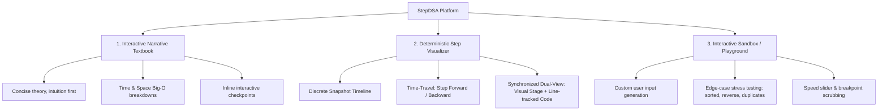

# Comparative Research: Interactive DSA Learning & Visualization Platforms

**Project:** StepDSA  
**Date:** 2026-09-26  
**Objective:** Deconstruct existing visualizers, interactive textbooks, and DSA sandboxes to design an elite, cohesive learning experience.

---

## 1. Competitive Landscape Analysis

| Platform | Core Focus & Strengths | Critical Weaknesses & Gaps | Key Architectural / UX Takeaways |
| :--- | :--- | :--- | :--- |
| **VisuAlgo** (NUS) | Comprehensive DSA catalogue, e-Lecture slide-ins, pseudocode line-highlighting, training mode with randomized quizzes. | Cluttered 2010s UI, high visual density, modal overload, not mobile-responsive, clunky custom inputs. | Synchronized pseudocode tracking is essential for educational connection; needs modern glassmorphic, decluttered layout. |
| **Algorithm Visualizer** (algorithm-visualizer.org) | Code-driven execution using custom Tracer APIs (`Array1DTracer`, `ChartTracer`), multi-language runtime, IDE layout. | Heavy developer focus; lacks structured beginner pedagogy; tracers require learning platform-specific logging code. | Decoupled Tracer Architecture: code emits state transitions (snapshots) that a renderer visualizes independently. |
| **CS Academy** (Graph Editor) | Fast text-to-visual workflow (adjacency/edge lists), force-directed layout, clean minimal UI, interactive graph manipulation. | Narrow algorithm scope (mostly graphs/geometry), limited multi-step tutorial narratives. | Live editable data inputs (e.g., paste an array or edge list) that instantly update the visual model without modal wizards. |
| **OpenDSA** | Academic depth, embedded JSAV exercises, Khan Academy-style proficiency questions, textbook chapter integration. | Clunky iframe/widget embedding, disjointed design system, feels like a traditional static textbook with bolted-on widgets. | Deep conceptual reading must weave visual stages seamlessly into prose rather than feeling like separate third-party embeds. |
| **CSVistool / USFCA** (David Galles) | Direct step-by-step canvas manipulation, zero distraction, historical gold standard for classroom explanation. | Zero code/pseudocode sync, 1990s canvas look, no dark mode, no narrative curriculum. | The simplicity of forward/back stepping through atomic operations (e.g., `highlight`, `compare`, `swap`, `shift`). |
| **alg0.dev** | Sleek, modern aesthetics, dark mode, smooth spring animations for basic algorithms (sorting, searching). | Limited catalog, basic interactions, lacks deep algorithmic complexity analysis or interactive debugging. | Modern visual polish (smooth SVG/Canvas transitions, dark themes, micro-animations) dramatically boosts engagement. |
| **Ironclad Academy & Learn Algo** | Structured curriculum tracks, progression milestones, gamified completion mechanics. | Visualizations are often static diagrams or non-scrubbable GIFs rather than fully interactive step engines. | Progressive curriculum path (from beginner arrays to DP and Graphs) with clear visual milestones. |

---

## 2. Key Synthesis: The StepDSA Triad

To fulfill the user goal of **Interactive Textbook + Algorithm Visualizer + DSA Playground**, StepDSA must integrate three interdependent pillars:



---

## 3. Core Architectural Engine: Snapshot Timeline Pattern

Existing platforms diverge between two execution paradigms:
1. **Live Async Animation Loops (Imperative `await sleep(ms)`):** Hard to reverse, impossible to scrub backward reliably without re-running from scratch, prone to race conditions.
2. **Deterministic Snapshot Generator (Declarative Timeline):**
   - The algorithm runs to completion instantly in pure code/WebWorker.
   - It records an immutable sequence of **Execution Frames**:
     ```ts
     interface ExecutionFrame {
       stepIndex: number;
       codeLine: number;
       description: string;
       state: {
         elements: Array<{ id: string; value: number | string; status: 'default' | 'comparing' | 'sorted' | 'active' | 'pivot' }>;
         pointers: Record<string, number>; // e.g. { i: 2, j: 5, low: 0, high: 9 }
         auxiliary?: Record<string, any>;
       };
     }
     ```
   - The UI renderer simply displays `frames[currentStep]`.
   - **Benefits:** Instant scrubbing, zero-drift reverse stepping, exportable traces, variable playback speed without breaking algorithm timing.

---

## 4. UI/UX Opportunities for StepDSA

1. **Integrated 3-Pane Responsive Layout:**
   - **Left / Collapsible Drawer:** Curriculum, concept explanation, real-world intuition, Big-O summary.
   - **Center / Main Stage:** High-contrast visualizer canvas (arrays, trees, graphs, grids) with animated pointers and value chips.
   - **Right / Bottom Panel:** Synchronized pseudocode / multi-language code (Python, JS, C++, Java) with active line glowing, plus step-by-step explanatory commentary.
2. **Interactive Stepper Bar:**
   - Play/Pause, Step Next (`→`), Step Back (`←`), Jump to Start, Jump to End.
   - Timeline scrubber with annotated milestone markers (e.g., "Pivot Selected", "Partition Complete").
3. **Data Input Bar:**
   - Presets: "Random", "Nearly Sorted", "Reversed", "Few Unique", "Worst Case", or custom CSV/array input.
