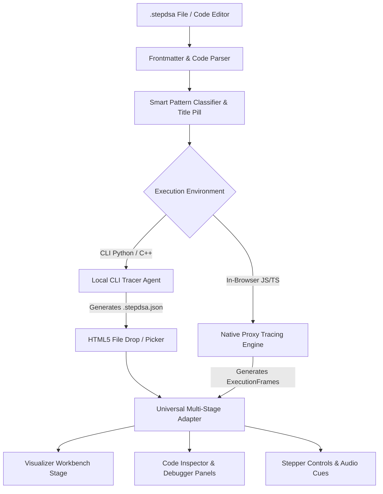

# Personal Code Studio & `.stepdsa` Tracing Engine — Architecture & Design Specification

- **Module Name:** Personal Code Studio (BYOC — Bring Your Own Code)
- **Target Version:** StepDSA v1.1.0
- **Status:** Approved Specification
- **Authors:** Antigravity & User

---

## 1. Executive Summary & Goals

StepDSA v1.0.0 provides 162 hardcoded, curated algorithm modules. **Personal Code Studio (BYOC — Bring Your Own Code)** expands the platform into a general-purpose, interactive visualizer where students, competitive programmers, and engineers author custom algorithms in a single `.stepdsa` file, run them with **zero visualizer-specific boilerplate**, and step through execution with full time-travel telemetry.

### Core Architecture Principles:
1. **100% Client-Side & Zero-Backend:** The StepDSA web app is a static SPA (deployable to GitHub Pages) with zero server infrastructure, zero database, and zero cloud execution costs. All in-browser code executes in the user's browser sandbox.
2. **TypeScript / Node.js Local CLI:** For native execution and offline developer workflows, StepDSA provides a TypeScript-powered CLI runnable via zero-install `npx @stepdsa/cli` or `node cli/stepdsa.js`, sharing 100% of types and schemas with the web visualizer.
3. **Smart Pattern Classifier & Editable Title Pill:** Competitive code (`class Solution { bool isValid() }`) is automatically analyzed to detect canonical patterns (e.g. Stack Bracket Matching) and surfaced with an editable title pill and auto-testcases.
4. **Native ES6 Proxy Tracing:** Eliminates heavy AST compiler dependencies in the browser; array operations (`arr[j]`, `arr[i] = val`) automatically emit telemetry frames at native V8 speed.
5. **Universal Multi-Stage Adapter:** Dynamic detection of data structure topology (1D/2D arrays, stack LIFO, trees, graphs) to mount the appropriate visual stage (`ArrayStage`, `TreeStage`, `GraphStage`, etc.).
6. **Embedded Source Synchronization:** Exact source code lines embedded in execution snapshots, allowing StepDSA's Code Inspector to highlight active statements in real time.

---

## 2. `.stepdsa` File Specification

A `.stepdsa` file is UTF-8 encoded text divided into two parts separated by triple-dash dividers (`---`):

```stepdsa
---
title: Quick Sort (Lomuto Partition)
category: sorting
difficulty: Intermediate
language: typescript
input: [45, 12, 89, 34, 21, 70, 5, 60]
stage: array
pointers: [i, j, pivot]
---
function partition(arr, low, high) {
  const pivot = arr[high];
  let i = low - 1;
  for (let j = low; j < high; j++) {
    if (arr[j] <= pivot) {
      i++;
      const temp = arr[i];
      arr[i] = arr[j];
      arr[j] = temp;
    }
  }
  const temp = arr[i + 1];
  arr[i + 1] = arr[high];
  arr[high] = temp;
  return i + 1;
}

function quickSort(arr, low, high) {
  if (low < high) {
    const pi = partition(arr, low, high);
    quickSort(arr, low, pi - 1);
    quickSort(arr, pi + 1, high);
  }
  return arr;
}

quickSort(input, 0, input.length - 1);
```

### Frontmatter Schema
- `title` *(string, optional)*: Explicit algorithm name. If omitted, inferred via the **Smart Pattern Classifier** or function name.
- `language` *(string, optional)*: `'typescript' | 'javascript' | 'python' | 'cpp'` (default: `'typescript'`).
- `category` *(AlgorithmCategory, optional)*: Default auto-detected from pattern.
- `input` *(any, optional)*: Test fixture passed to algorithm. If omitted, auto-generated based on detected pattern.
- `stage` *(string, optional)*: Explicit stage hint (`'array' | 'stack' | 'tree' | 'graph' | 'grid'`). If omitted, auto-detected.
- `pointers` *(string[], optional)*: Named variable identifiers to track as visual stage pointers (e.g. `['i', 'j', 'pivot', 'low', 'high', 'top']`).

---

## 3. Architecture & Data Flow



### 3.1 Smart Pattern Classifier & Editable Title Pill (`src/core/studio/classifier.ts`)
When user code is pasted (especially competitive programming code like `class Solution { bool isValid(...) }` or `int solve(...)`):
1. **Keyword & AST Pattern Scan:**
   - Detects `st[top]`, `stack`, `push`, `pop`, bracket matching `()[]{}` ➔ Infers: **"Valid Parentheses (Stack)"** (Category: `stack-queue`, Stage: `stack`).
   - Detects `mid = (low + high) / 2`, `low <= high` ➔ Infers: **"Binary Search"** (Category: `searching`, Stage: `array`).
   - Detects nested loop with adjacent swap `arr[j] > arr[j+1]` ➔ Infers: **"Bubble Sort"** (Category: `sorting`, Stage: `array`).
   - Detects two pointer convergence `left < right` ➔ Infers: **"Two Pointers"** (Category: `arrays-pointers`, Stage: `array`).
2. **Editable 1-Click Title Pill:**
   - Displayed prominently in the Studio header: `[ 🏷️ Valid Parentheses (Stack) ✏️ ]`.
   - User can click the pill to rename or customize it in 1 second.
3. **Auto-Testcase Generation:**
   - If `input` is empty in frontmatter, automatically provides sensible default test fixtures (e.g. `"()[]{}"` for bracket matching, `[64, 34, 25, 12, 22]` for array algorithms).

### 3.2 Frontmatter & Code Parser (`src/core/studio/parser.ts`)
- Parses `.stepdsa` files using clean regex (no heavy YAML dependencies).
- Extracts `metadata`, test `input`, and raw `code` string.
- Validates syntax cleanly without throwing uncaught exceptions.

### 3.3 Native Proxy Tracing Engine (`src/core/studio/tracer.ts`)
- Wraps the input data structure in an ES6 `Proxy`:
  - **`get(target, prop)`**: Intercepts element reads (`arr[j]`), records read/compare operations with active pointers.
  - **`set(target, prop, value)`**: Intercepts element writes (`arr[i] = val`), records assignment/swap states.
- 0 npm dependencies, running with native V8 JavaScript speed.
- Emits standard `ExecutionFrame` objects adhering strictly to StepDSA's `ExecutionFrame` interface.

### 3.4 Universal Multi-Stage Adapter (`src/core/studio/universalAdapter.ts`)
- Takes raw frames and resolves the visual renderer:
  - If state holds 1D array (`array: number[]` or `{ value, status }[]`): maps to `ArrayStage`.
  - If state holds stack LIFO structure: maps to `StackStage` / `ArrayStage`.
  - If state holds 2D grid: maps to `GridStage` / `MatrixStage`.
  - If state holds node hierarchy with `left`/`right` or `children`: maps to `TreeStage`.
  - If state holds nodes & edges or adjacency lists: maps to `GraphStage`.
  - Fallback: Renders a clean generic inspector with variable inspection and memory state.

### 3.5 Personal Code Studio Modal & Editor (`PersonalCodeStudioModal.tsx`)
- Tab 1: **Interactive In-Browser Editor** with syntax highlighting, Smart Pattern Title Pill, and "Visualize Code" button.
- Tab 2: **Drop Zone** for `*.stepdsa` and `*.stepdsa.json` files with instant validation.
- Tab 3: **CLI Setup & Instructions** for running native Python and C++ algorithms.

---

## 4. Error Handling & Sandboxing

1. **Infinite Loop Protection:**
   - Tracing engine sets a hard safety ceiling (e.g., maximum 500 frames or 10,000 operations).
   - If an infinite loop is detected, execution gracefully halts with an explanation banner: *"Execution paused: safety limit reached (500 steps) to prevent browser freeze."*
2. **Syntax & Runtime Errors:**
   - Caught in `try...catch` and surfaced in a dedicated error panel inside the Studio modal, pointing to the exact line number.
3. **Schema Validation:**
   - Validates `.stepdsa` frontmatter and `.stepdsa.json` snapshots against strict schemas, showing actionable hints for missing fields.

---

## 5. Testing & Verification Plan

1. **Unit Tests (`src/core/studio/parser.test.ts`):**
   - Validates parsing of standard `.stepdsa` files with various frontmatter configurations.
   - Verifies handling of edge cases (missing frontmatter, invalid YAML, empty code).
2. **Tracer Tests (`src/core/studio/tracer.test.ts`):**
   - Verifies that sorting an array via a standard `for` loop generates complete `ExecutionFrame`s with `callStack`, `variables`, `soundCue`, and `pointers`.
3. **Integration Test (`src/App.test.tsx`):**
   - Tests opening Personal Code Studio, loading a custom `.stepdsa` code string, and verifying that the Visualizer Workbench transitions and renders correctly.
4. **Build & Typecheck:**
   - `npx tsc --noEmit` and `npm run build` must pass with 0 errors.
