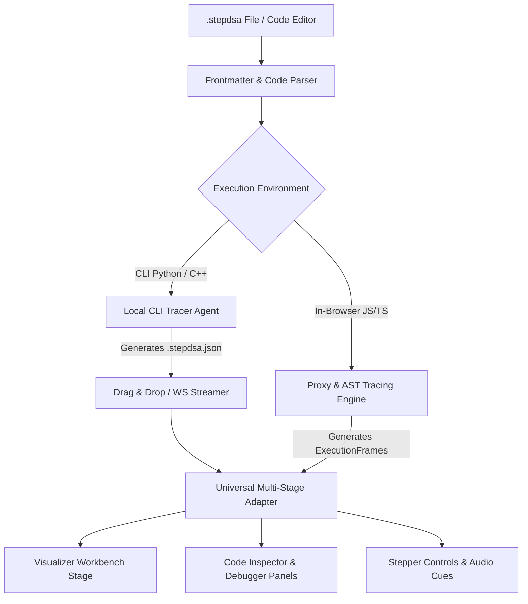

# Personal Code Studio & `.stepdsa` Tracing Engine — Architecture & Design Specification

- **Module Name:** Personal Code Studio (BYOC — Bring Your Own Code)
- **Target Version:** StepDSA v1.1.0
- **Status:** Approved Specification
- **Authors:** Antigravity & User

---

## 1. Executive Summary & Goals

StepDSA v1.0.0 provides 162 hardcoded, curated algorithm modules. **Personal Code Studio** expands the platform into a general-purpose, interactive visualizer where students, competitive programmers, and engineers author custom algorithms in a single `.stepdsa` file, run them locally or directly in the browser with **zero visualizer-specific boilerplate**, and step through execution with full time-travel telemetry.

### Key Capabilities
1. **`.stepdsa` File Standard:** A clean human-authored format combining YAML frontmatter (metadata, input fixtures, visual hints) with 100% standard, unescaped algorithm code (TypeScript/JavaScript, Python, C++).
2. **Transparent Tracing Engine:** Automatic detection of memory reads, writes, swaps, and comparisons using transparent Proxies and AST instrumentation. Users write ordinary loops and conditionals without proprietary SDK function calls.
3. **Dual Execution Pipeline:**
   - **In-Browser Studio:** Built-in code editor + drag-and-drop `.stepdsa` parser for instant client-side execution.
   - **Local CLI (`stepdsa`):** Command-line tool for tracing native Python/C++ scripts and generating `.stepdsa.json` traces or streaming over WebSocket (`ws://localhost:9123`).
4. **Universal Multi-Stage Adapter:** Dynamic detection of data structure topology (1D/2D arrays, linked lists, trees, graphs) to mount the appropriate high-contrast visual stage (`ArrayStage`, `TreeStage`, `GraphStage`, etc.).
5. **Embedded Source Synchronization:** Exact source code lines embedded in execution snapshots, allowing StepDSA's Code Inspector to highlight active statements in real time.

---

## 2. `.stepdsa` File Specification

A `.stepdsa` file is UTF-8 encoded text divided into two parts separated by triple-dash dividers (`---`):

```stepdsa
---
title: Quick Sort (Lomuto Partition)
category: sorting
difficulty: Intermediate
language: typescript
input: [45, 12, 89, 34, 21, 70, 5, 60]
stage: array
pointers: [i, j, pivot]
---
function partition(arr, low, high) {
  const pivot = arr[high];
  let i = low - 1;
  for (let j = low; j < high; j++) {
    if (arr[j] <= pivot) {
      i++;
      const temp = arr[i];
      arr[i] = arr[j];
      arr[j] = temp;
    }
  }
  const temp = arr[i + 1];
  arr[i + 1] = arr[high];
  arr[high] = temp;
  return i + 1;
}

function quickSort(arr, low, high) {
  if (low < high) {
    const pi = partition(arr, low, high);
    quickSort(arr, low, pi - 1);
    quickSort(arr, pi + 1, high);
  }
  return arr;
}

quickSort(input, 0, input.length - 1);
```

### Frontmatter Schema
- `title` *(string, required)*: Human-readable algorithm name.
- `language` *(string, required)*: `'typescript' | 'javascript' | 'python' | 'cpp'`.
- `category` *(AlgorithmCategory, optional)*: Default `'arrays-pointers'`.
- `input` *(any, required)*: The primary data structure or fixture passed as `input` into the user code.
- `stage` *(string, optional)*: Explicit stage hint (`'array' | 'tree' | 'graph' | 'grid'`). If omitted, auto-detected.
- `pointers` *(string[], optional)*: Named variable identifiers to track as visual stage pointers (e.g. `['i', 'j', 'pivot', 'low', 'high']`).

---

## 3. Architecture & Data Flow



### 3.1 Frontmatter & Code Parser (`src/core/studio/parser.ts`)
- Parses `.stepdsa` files using clean regex / YAML extraction.
- Extracts `metadata` and raw `code` string.
- Validates required fields, providing friendly error toasts if frontmatter is malformed.

### 3.2 Transparent In-Browser Tracing Engine (`src/core/studio/tracer.ts`)
- Wraps the input data structure in an ES6 `Proxy`:
  - **`get(target, prop)`**: Intercepts element reads (`arr[j]`), records read/compare operations with active pointers.
  - **`set(target, prop, value)`**: Intercepts element writes (`arr[i] = val`), records assignment/swap states.
- Instruments loops or function calls to capture line numbers, call stack, and variable scopes.
- Emits standard `ExecutionFrame` objects adhering strictly to StepDSA's `ExecutionFrame` interface.

### 3.3 Universal Multi-Stage Adapter (`src/core/studio/universalAdapter.ts`)
- Takes raw frames and resolves the visual renderer:
  - If state holds 1D array (`array: number[]` or `{ value, status }[]`): maps to `ArrayStage`.
  - If state holds 2D grid: maps to `GridStage` / `MatrixStage`.
  - If state holds node hierarchy with `left`/`right` or `children`: maps to `TreeStage`.
  - If state holds nodes & edges or adjacency lists: maps to `GraphStage`.
  - Fallback: Renders a clean generic inspector with variable inspection and memory state.

### 3.4 Personal Code Studio Modal & Editor (`PersonalCodeStudioModal.tsx`)
- Tab 1: **Interactive In-Browser Editor** with syntax highlighting, template picker (Bubble Sort, Two Pointers, DFS, Binary Tree), and "Visualize Code" button.
- Tab 2: **Drop Zone** for `*.stepdsa` and `*.stepdsa.json` files with instant validation.
- Tab 3: **CLI Setup & Instructions** for running native Python and C++ algorithms.

---

## 4. Error Handling & Sandboxing

1. **Infinite Loop Protection:**
   - Tracing engine sets a hard safety ceiling (e.g., maximum 500 frames or 10,000 operations).
   - If an infinite loop is detected, execution gracefully halts with an explanation banner: *"Execution paused: safety limit reached (500 steps) to prevent browser freeze."*
2. **Syntax & Runtime Errors:**
   - Caught in `try...catch` and surfaced in a dedicated error panel inside the Studio modal, pointing to the exact line number.
3. **Schema Validation:**
   - Validates `.stepdsa` frontmatter and `.stepdsa.json` snapshots against strict schemas, showing actionable hints for missing fields.

---

## 5. Testing & Verification Plan

1. **Unit Tests (`src/core/studio/parser.test.ts`):**
   - Validates parsing of standard `.stepdsa` files with various frontmatter configurations.
   - Verifies handling of edge cases (missing frontmatter, invalid YAML, empty code).
2. **Tracer Tests (`src/core/studio/tracer.test.ts`):**
   - Verifies that sorting an array via a standard `for` loop generates complete `ExecutionFrame`s with `callStack`, `variables`, `soundCue`, and `pointers`.
3. **Integration Test (`src/App.test.tsx`):**
   - Tests opening Personal Code Studio, loading a custom `.stepdsa` code string, and verifying that the Visualizer Workbench transitions and renders correctly.
4. **Build & Typecheck:**
   - `npx tsc --noEmit` and `npm run build` must pass with 0 errors.
